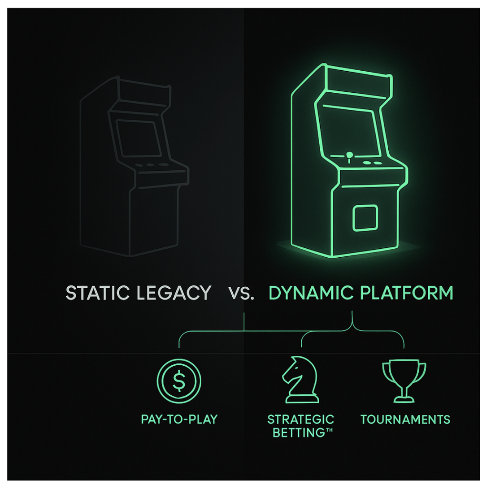
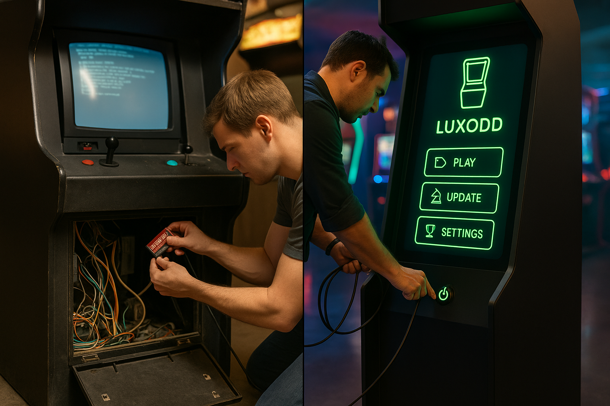

# Luxodd vs. Traditional Arcade Cabinets

## Insider Review 

An Insider Comparison

When it comes to arcade cabinets, Luxodd’s modern arcade platform is a whole new ballgame compared to a traditional arcade cabinet. Here, we’ll break down every relevant difference – from cost and revenue to player fun and future growth. Whether you’re an arcade operator, venue manager, game developer, or curious investor, grab a cup of coffee and let’s dive in!

<!-- truncate -->

## What Is Luxodd? 

Luxodd is a next-generation arcade gaming platform that bills itself as the “world’s first strategic betting arcade” designed to create a competitive, high-revenue ecosystem. Unlike classic arcade machines that typically play a single game, a Luxodd cabinet is a multi-game, connected system with built-in features like pay-to-play gaming, Strategic BettingTM (mission-based skill betting), and tournaments. 

In other words, Luxodd isn’t just another arcade machine – it’s an entire platform where new games and features can be added on the fly, much like apps on a smartphone.

Now, how does that compare to the good old traditional arcade cabinets we grew up with? Let’s break it down by key aspects, and see what it all means for different folks in the arcade world (merchants, players, developers – everyone!). 

## Financials: Cost Potential 

From a business standpoint, money talks, so let’s start with cost and revenue. Traditional arcade cabinets often come with a hefty upfront price tag. A brand-new arcade unit in 2025 could cost anywhere from around $5,000 to $10,000 on average, and popular deluxe titles can exceed $15,000 each. 

That means if you’re an operator wanting the latest racing game or light-gun shooter, you might be looking at a five-figure investment per machine. Sure, you might find a used game for a few thousand less, but either way it’s a significant capital expense.

Now, what about Luxodd’s cabinet? The exact pricing for a Luxodd unit isn’t set in stone, but the big difference is one cabinet isn’t tied to one game. With a traditional cab, if players lose interest in the game after a while (which happens frequently – arcade games historically have a “shelf life” of 6–12 months before earnings drop off), you’re stuck unless you swap hardware. 

Arcade operators in the old days literally had to keep buying new games or conversion kits every few months to keep the quarters flowing. That’s a pricey and labor-intensive cycle. Luxodd breaks that cycle. 

One Luxodd cabinet can continually refresh its content, so the cost of offering a new game is basically the one-time download or license fee – not buying an entire new machine. This dramatically lowers the cost per new game. 

An arcade owner could turn the same Luxodd cabinet in the corner from a racing game one day into a fighting game the next, simply by installing new software overnight. 

Read more about it here

## Financials: Multiple Revenue Streams 

On the revenue side, traditional machines typically earn money through pay-per-play – a few quarters or a swipe of a game card for each session. That’s basically one revenue stream per machine. 

Operators have long learned to diversify by filling their locations with different types of games (video games, redemption games, pinball, etc.) and by running events. 

Luxodd’s model bakes multiple revenue streams into one cabinet. Each Luxodd game can earn from standard play and from new mechanisms: imagine players wagering a small fee for a mission challenge (with the chance to win real money) or paying an entry fee for a tournament with other arcade-goers. 

Luxodd explicitly offers pay-to-play, Strategic BettingTM and tournaments as integrated monetization options. More revenue streams mean an operator isn’t just relying on sheer volume of plays; they can get revenue from, say, a Friday night tournament pot or players paying to re-attempt a tough challenge. 

In fact, Luxodd markets itself as having “triple the revenue streams of the typical arcade” – meaning each cabinet can potentially make money in three ways instead of one.

For arcade operators and venue owners, this is huge. It means better ROI on each square foot of floor space. A single Luxodd machine might pull in what two or three separate traditional machines would, by keeping players spending in different ways. 

## Enhanced Player Experience and Engagement Via Tournaments 

Let’s switch over to the players . After all, happy players pump tokens (or tap credit cards) into these machines. 

Traditional arcade cabinets have their charm: a great game can still hook people for years. But one thing we’ve seen is that today’s gamers crave variety and competition. 

In a classic arcade, variety means a room full of different dedicated machines. Competition might mean trying to beat the high score on the machine or maybe a local head-to-head on a fighting game, but that’s usually where it ends. 

Organized tournaments are not common unless the arcade owner arranges one, and there’s typically no online play or matchmaking on coin-ops from the 90s (or even 2000s).

Luxodd cabinets are built to maximize engagement by keeping things fresh and social. Luxodd’s built-in tournament system means players can compete for top scores or brackets on the machine network itself, possibly even across multiple locations in the future.

Arcades that host events and tournaments have seen increased foot traffic and player enthusiasm. Luxodd basically turbocharges that idea: you could have nightly challenges, leaderboards, and prizes (monetary or otherwise). This creates a community around the machine – players aren’t just playing against the game, they’re playing against each other in structured ways that a normal cabinet doesn’t support.

In short, for players, Luxodd cabinets promise more choices, more competition, and more reasons to stay engaged. It’s like the difference between an arcade where the lineup is static versus one where there’s always a new high score to chase or a new game to master. A traditional arcade cab might be a fun one-time fling; a Luxodd feels more like an ongoing relationship that evolves with the player.

## Ease of Setup, Updates, and Maintenance 

If you’ve ever owned or managed an arcade game, you know they can be labor-intensive. Traditional cabinets often require careful setup: tuning the monitor, setting DIP switches for game options, adjusting coin mechs, etc. 

When something breaks (and in a public arcade, things will break eventually), you might need to roll up your sleeves and replace parts or call a technician. And when it’s time to update the game, well… that usually isn’t even possible unless you have a conversion kit or a whole new PCB (printed circuit board) to install.

Luxodd takes a much more modern, plug-and-play approach. Setting up a Luxodd cabinet involves connecting it to the internet and powering it on, rather than fussing with hardware settings. You can expect a user-friendly interface. 

In fact, Luxodd has an admin portal (a web-based dashboard) for arcade owners. Through this portal, an operator can choose which games to run, schedule updates, check earnings, and more – all without opening up the machine’s back panel. This is a far cry from traditional cabs where switching games means physical work (swapping boards or cabinets).

## Analytics and control 

Another aspect is analytics and control. A traditional arcade game might have a mechanical coin counter or an internal bookkeeping menu to tell you how many plays it got. Luxodd, by contrast, gives you rich data through its admin portal: which games are most popular, what times of day see the most play, your total revenue, etc. 

For an operator, these insights are gold. It’s like having Google Analytics for your arcade cabinet. Plus, remote control means you could switch the game or adjust pricing on the fly in response to what you see, without even being on site.

## Two Sizes for Increased Flexibility   

Real estate inside an arcade or venue is precious. Traditional arcade cabinets, especially the commercial-grade ones, can be huge. They often use “heavily reinforced hardware” and are “really bulky and heavy”.

Think of those driving simulators with full seats, or light-gun games with giant screens – they take up a lot of space and are not easy to move once in place. Even a standard upright cabinet is roughly the size of a refrigerator (and some are heavier than one!). 

For a venue, this means you can only fit so many games, and you’d better choose ones that earn well per square foot. Luxodd cabinets aim for a smaller footprint with maximum versatility. 

A sleeker cabinet that can snugly fit in a corner or against a wall means more placement options (and possibly lower shipping costs too).

But the biggest space saver is what we touched on earlier: one Luxodd machine can replace multiple traditional machines worth of content. If you want to offer 10 different games in a classic arcade, you need space for 10 cabinets. 

With Luxodd, theoretically, one or two cabinets could cycle through dozens of titles. 
That’s a huge win for bar owners, bowling alley managers, entertainment venues—anywhere that wants to bring in arcade revenue without remodeling or dedicating a big area. 

Venue owners could drop one in a spot that normally couldn’t host arcade gear, like a small café or hotel lounge and still make it work.

Here’s a quick size breakdown for perspective:

- **Luxodd Rook**: 796x720 – a full-size unit that fits tight spaces way better than a standard arcade cab.
- **Luxodd Pawn**: 628x600 – a compact bartop-style unit, perfect for rentals, events, or small-venue placements.

Bottom line? Bigger isn’t always better. In Luxodd’s case, compact and flexible wins the day. Merchants get to make every inch of their venue work harder, not just for fun, but for your bottom line too. A  small coffee shop with a single versatile cabinet (something not feasible with bulky traditional machines) is now a lot easier to accomplish. 

## Conclusion
In this friendly face-off between Luxodd and traditional arcade cabinets, it’s clear that Luxodd brings a flexible, modern, “arcade-as-a-platform” philosophy, whereas traditional cabinets carry the legacy of dedicated, single-game experiences. 

Each has its charm. But for today’s arcade operators looking to thrive, Luxodd offers a compelling vision: one where games are swapped like magic, players compete in new ways, and every stakeholder from the venue owner to the game creator can benefit.

To summarize in plain terms: a traditional cabinet is like a classic car (iconic, but you get what you bought, and it requires hands-on upkeep). A Luxodd cabinet is like a Tesla – high-tech, software-driven, and it might even make you money while parked. It transforms the arcade cabinet from a static piece of furniture into a dynamic service.

For operators and venue managers, it means more bang for their buck and square footage. For players, it means more fun and competition every time they visit. For developers, it means a new marketplace for arcade content. And for Luxodd, if all goes well, it means a growing network and a sustainable slice of the arcade revival.

_© 2025 Luxodd Games. All rights reserved._
