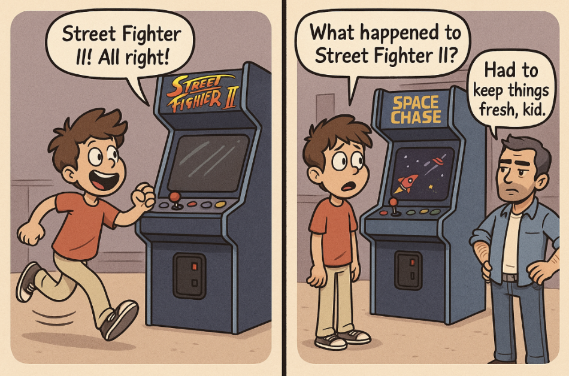
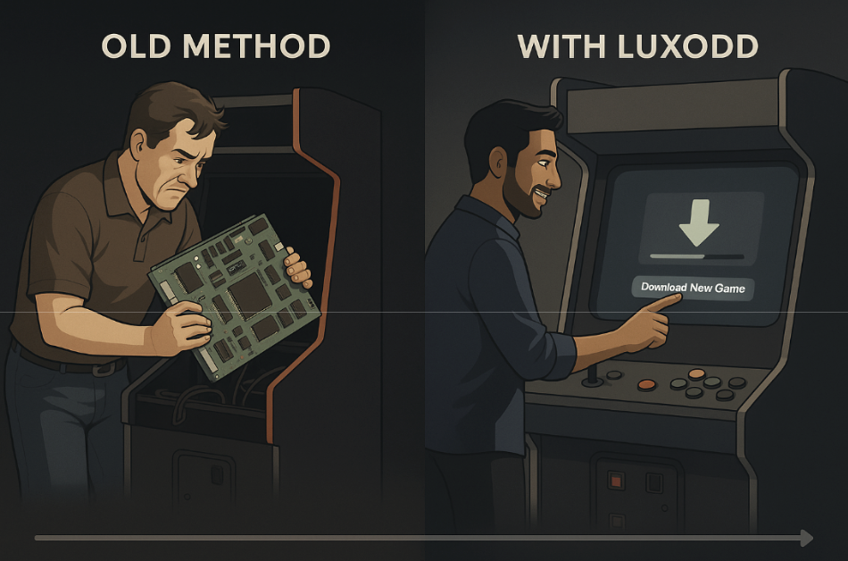
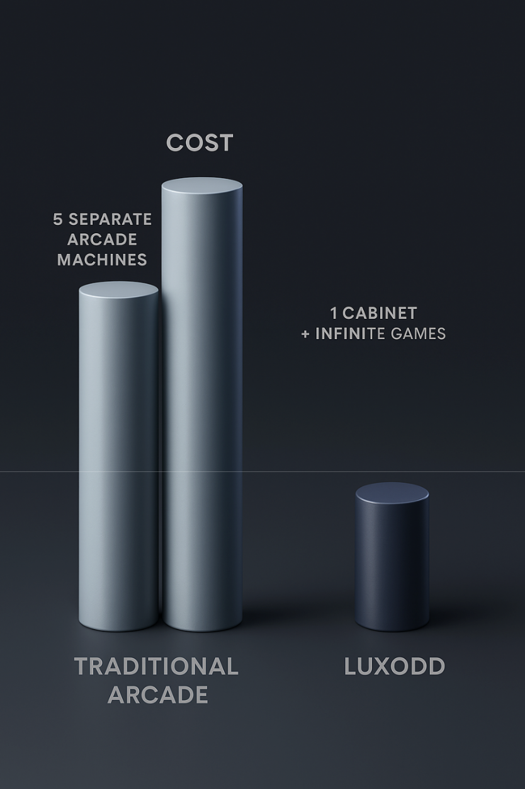

# One Arcade Cabinet, Endless Games

## Why One Luxodd Cabinet Is All You’ll Ever Need

Rohan is a lifelong arcade fan who’s seen it all. As a kid, Rohan watched arcade owners struggle with bulky one-game machines. 

Now, as an adult running his own arcade, Rohan is witnessing a revolution. He’s discovered Luxodd, a modern arcade cabinet system where new games are just a download away. 

In this story, we’ll explore how Luxodd’s “one cabinet, many games” approach trumps the traditional arcade model. Along the way, we’ll see how it benefits players, arcade owners, and game developers alike,  all through Rohan’s eyes.

<!-- truncate -->

## The Old Way: When New Games Meant New Machines

Rohan remembers the traditional arcade days vividly. Back then, each arcade cabinet was dedicated to a single game. If an arcade wanted a hot new title, it often meant buying an entire new machine (often thousands of dollars each) or swapping out hardware parts in an old one. 

He once watched an arcade operator literally pull out the circuit board of a game to replace it with a new game’s board, which is a common hack to avoid purchasing a whole new cabinet. 
Switching games meant real labor: unscrewing panels, rewiring, replacing art marquees, or hauling machines in and out. Arcades might close early just to do a game swap, and there was always the risk something wouldn’t work when plugged back in.

It was costly, time-consuming, and physically demanding (those classic cabinets weigh a couple hundred pounds on average!). And if space was tight, adding a new game meant removing an old favorite, which young Rohan never liked.

Rohan recalls how excited he was to play Street Fighter II at his local arcade, only to find the machine replaced a year later by a different game. The owner had to keep things fresh to survive, as an arcade cabinet’s shelf life was maybe 6-12 months before players moved on. 

Unfortunately, that meant constantly rotating machines. It was the only way back then: new game, new machine.

## One Cabinet, Many Games (The Luxodd Revolution)

Fast forward to today: Rohan’s arcade is running on Luxodd’s arcade platform, and it feels like science fiction compared to the old days. Luxodd’s cabinets are high-tech, flexible machines that can switch games with a simple download from the Luxodd Marketplace. 

In other words, one cabinet can host an entire library of games. No wrench-turning or heavy lifting required! Last week, Rohan heard about a cool new indie fighting game gaining buzz. 

Instead of trying to import a dedicated machine (which might have taken weeks and cost a fortune), Rohan simply browsed the Luxodd Marketplace, found the game, and clicked “Download”. 

In minutes, that same cabinet in the corner – the one that yesterday was running a racing game – had the new fighting game installed and ready. When his arcade opened the next day, regular players were amazed to see a new game on the very same machine they played last night.

  <a href="www.luxoddgames.com/reservation"
     style="display:inline-block;padding:14px 32px;background:#00ff8a;color:#0b0b0b;
            font-family:'Inter',Arial,sans-serif;font-size:1rem;font-weight:700;
            text-decoration:none;border-radius:999px;
            box-shadow:0 0 8px #00ff8a,0 0 20px rgba(0,255,138,.6);
            transition:transform .15s ease,box-shadow .15s ease;"
     onmouseover="this.style.transform='scale(1.04)';this.style.boxShadow='0 0 12px #00ff8a,0 0 28px rgba(0,255,138,.8)';"
     onmouseout="this.style.transform='scale(1)';this.style.boxShadow='0 0 8px #00ff8a,0 0 20px rgba(0,255,138,.6)';">
    🔥 Reserve your Luxodd cabinet at <strong>30 % OFF</strong>
  </a>

## “So you’re telling me you’ll never replace that cabinet?”

Rohan’s friend (who runs another arcade across town) was skeptical at first. “So you’re telling me you’ll never replace that cabinet?” the friend asked. Rohan just grinned and showed how the Luxodd machine already had three different games installed that he could switch between on the fly. 

In fact, Luxodd lets arcade owners keep up to 5 games at a time downloaded per machine to avoid cluttering the menu. It’s plenty to offer variety, and swapping in a different title only takes a few minutes if he wants a change

## Why Players Love It

From a player’s perspective, Luxodd-powered arcades feel like a paradise. Here’s why players are pumped about this model:

- **More Variety**: No more being limited to whatever fixed games are bolted to the floor. One day the cabinet hosts Space Invaders, the next week it might feature a new indie rhythm game.

- **Old Favorites Live On**: With traditional arcades, if an old game wasn’t earning enough, it vanished. But Luxodd allows arcades to rotate classics back in easily. Players often come in and exclaim, “Oh wow… I haven’t seen this game in YEARS!”. That mix of nostalgia and novelty keeps players coming back.

## Why Arcade Owners Love It

### Set it and forget it

For operators like Rohan, Luxodd’s model is a game-changer in terms of cost and convenience. Rohan still remembers budgeting for his arcade’s opening. Traditionally, he might have had to buy 10 different cabinets to offer 10 games – a huge upfront cost. 

Instead, he started with a few Luxodd machines and immediately had a full lineup of games. Here’s why arcade merchants are on board:

- **Lower Cost, Higher Flexibility**: Instead of shelling out thousands for each new arcade cabinet, owners invest in one versatile machine. New games are software purchases (often much cheaper) or even free. In fact, Luxodd provides a selection of in-house games completely free to install and run, so an arcade owner can have quality content with zero upfront game cost. For other games, the owner pays a one-time fee to unlock it on the machine – but again, that’s a fraction of buying new hardware.

- **Risk-Free Trials**: Luxodd’s Marketplace even offers a 7-day free trial for any game. Think about that: Rohan can test a new title in his arcade for a week, see if players like it, and only then decide to buy it permanently. The old way offered no such safety net – once you bought a big arcade machine, you were stuck with it. With Luxodd, it’s try before you buy, no obligation.

- **Easy Updates & Maintenance**: All the game management happens through a digital dashboard. Rohan can update games or system software online (Luxodd pushes updates like bug fixes or new features regularly). Maintenance is simpler too, since he’s dealing with standardized hardware across all games. No need to hunt down a rare replacement part for a 20-year-old cabinet; Luxodd machines use modern components and are built to be serviced easily.

- **Space Efficiency**: Arcade real estate is precious. With multi-game cabinets, a small venue can offer a big library. Rohan’s arcade has a cozy footprint, but thanks to Luxodd, each cabinet is like 5 machines in one. He can rotate titles to keep the lineup interesting without crowding the floor with more equipment. This also means lower electricity usage and less clutter.

  <a href="www.luxoddgames.com/reservation"
     style="
       display:inline-block;
       padding:14px 32px;
       background:#00ff8a;
       color:#0b0b0b;
       font-family:'Inter',Arial,sans-serif;
       font-size:1rem;
       font-weight:700;
       text-decoration:none;
       border-radius:999px;
       box-shadow:0 0 8px #00ff8a, 0 0 20px rgba(0,255,138,.6);
       transition:transform .15s ease, box-shadow .15s ease;
     "
     onmouseover="this.style.transform='scale(1.04)';this.style.boxShadow='0 0 12px #00ff8a, 0 0 28px rgba(0,255,138,.8)';"
     onmouseout="this.style.transform='scale(1)';this.style.boxShadow='0 0 8px #00ff8a, 0 0 20px rgba(0,255,138,.6)';">
    💡 Cut costs—download new games in minutes. <strong>Save 30 %</strong>
  </a>

- Rohan often uses the phrase “set it and forget it” for his Luxodd cabinets. Once a game is downloaded, it just works. And if he ever wants to shake things up, it’s a few clicks, not a weekend project with screwdrivers and dollies. The result? Better ROI for his business and a lot less stress.

## Why Game Developers Love It 

Rohan has a friend, Renata, who develops indie games. In the past, Renata could only dream of having her game in arcades; the barrier to entry was just too high. But Luxodd’s digital marketplace changes the playing field for developers:

- **Easier Distribution**: Luxodd acts like an app store for arcade games. Developers can get their games onto the marketplace without manufacturing physical arcade boards or striking deals with hardware makers. For Renata, this means she can focus on making a great game – Luxodd handles the delivery. Any arcade in the world using Luxodd could potentially download her game. That global reach was unimaginable in the old days for a small developer.

- **Revenue Share**: The economics are developer-friendly. When Rohan buys a third-party game from the Luxodd Marketplace, 90% of that purchase goes to the game’s developer (Luxodd takes only a 10% cut). Compare this to traditional arcades, where a developer might only earn money by selling the hardware once, with no share of ongoing play. And it gets better – after the game is live, developers also get a slice of each play session revenue. Luxodd splits the play income so that 10% goes to the developer (with the rest shared by the arcade and Luxodd). In short, devs earn when their game is installed and every time it’s played.

- **Updates and Support**: If Renata wants to update her game (patch a bug or add new levels), she can push an update through Luxodd. In the coin-op era, a bug in an arcade game was practically permanent once the machine shipped. Now, arcades can get game updates just like your phone does. Developers can continue to improve and add content, keeping games alive and players engaged.

Rohan has seen this first-hand. He added Renata’s indie game to his arcade and watched it become a surprise hit with local college students. Without Luxodd, that game would never have left the PC scene. Now it’s a revenue-generator for Rohan and a success story for Renata, the developer.

## Rohan’s Arcade: A Story of Evolution and Excitement

Throughout this journey, Rohan serves as a living example of how Luxodd’s model benefits everyone:

- As a player, young Rohan wished for more games without losing the ones he loved. Today’s arcades deliver exactly that, thanks to flexible cabinets.

- As an arcade owner, Rohan can provide variety and keep costs down, ensuring his arcade thrives as a business and remains a fun place to visit. He doesn’t have to gamble on big hardware purchases or deal with the hassle of upgrades.

- As a fan of games and friend to developers, Rohan is thrilled to showcase indie titles alongside famous classics. He becomes known in the community for always having something new to play, and he takes pride in helping new game creators find an audience.

> “It’s like Netflix for arcade games.”

Rohan often finds himself explaining this to curious customers, and he does so with a smile: “Think of it like Netflix for arcade games,” he says. “I can add or remove games whenever I want. So you’ll never be bored, and I’ll never go broke keeping you entertained!”

Rohan locks up his arcade for the night, but he’s not done working. With a few clicks on the Luxodd Marketplace, he queues up a new game download to surprise his customers tomorrow. As the soft neon glow from his Luxodd cabinet flickers across the quiet arcade floor, Rohan takes one last look before locking up. 

He then chuckles to himself, “Luck’s odd, but with Luxodd, arcades finally feel like a sure bet” Rohan smiles and heads out, already excited for what tomorrow’s download will bring.

  <a href="www.luxoddgames.com/reservation"
     style="
       display:inline-block;
       padding:14px 32px;
       background:#00ff8a;
       color:#0b0b0b;
       font-family:'Inter',Arial,sans-serif;
       font-size:1rem;
       font-weight:700;
       text-decoration:none;
       border-radius:999px;
       box-shadow:0 0 8px #00ff8a, 0 0 20px rgba(0,255,138,.6);
       transition:transform .15s ease, box-shadow .15s ease;
     "
     onmouseover="this.style.transform='scale(1.04)';this.style.boxShadow='0 0 12px #00ff8a, 0 0 28px rgba(0,255,138,.8)';"
     onmouseout="this.style.transform='scale(1)';this.style.boxShadow='0 0 8px #00ff8a, 0 0 20px rgba(0,255,138,.6)';">
    🚀 Join the arcade evolution—lock in <strong>30 % OFF</strong>
  </a>

 
