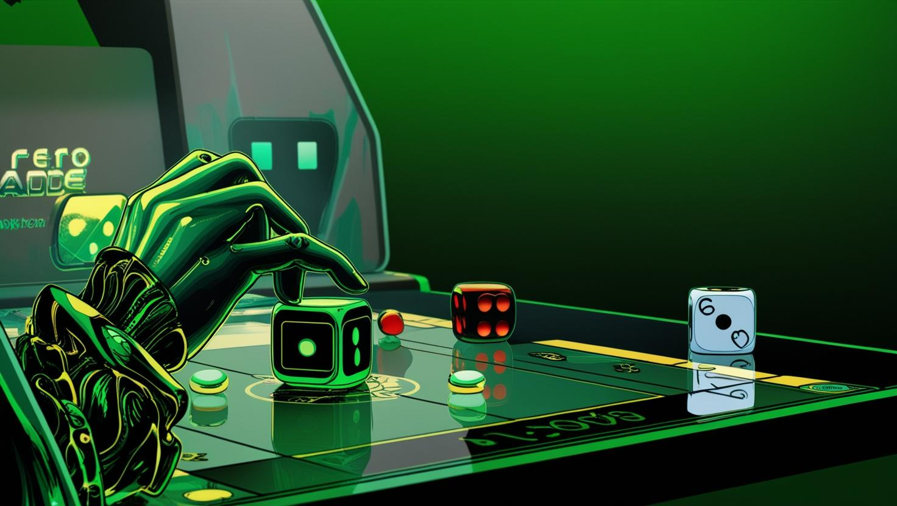

Have you ever meticulously planned every move in a strategy game, only to watch helplessly as a dice roll, card draw, or random event derails your entire strategy? If you're nodding along, you're not alone. Strategy games, renowned for their depth and intellectual challenge, increasingly rely on randomness to add excitement—but this approach is causing frustration among gamers who value skill, strategy, and fair competition.

Let's explore why randomness (often called RNG, or Random Number Generation) is hurting strategy games, and why gamers are now looking towards deterministic alternatives that reward genuine skill and decision-making.

<!-- truncate -->

**What Exactly is RNG?**

At its core, randomness in strategy games means the outcome of certain actions is left up to chance. Think about rolling dice in board games or the percent-chance shots in games like _XCOM_, a critically acclaimed turn-based strategy game series developed by Firaxis Games.

Players command a squad of elite soldiers fighting against an alien invasion, using cover-based tactics and turn-based combat. The game is known for its RNG-driven combat system, where every shot has a percentage chance to hit, making luck a significant factor in battle outcomes.

In XCOM 2, players frequently encounter high-percentage shots that still miss, leading to frustration among competitive and casual players alike. Missing a 90% hit chance despite making the right strategic decision often feels unfair, sparking debates about RNG's place in competitive gaming (Cobbett, 2016).

As [**Polygon**](https://www.polygon.com/2020/1/16/21067906/random-number-generator-rng-probability-xcom-spelunky-input-output#:~:text=There's%20one%20genre%20that%20this,input%20randomness%2C%20in%20this%20video) reported, gamers frequently describe the "_getting-screwed_" mindset of feeling like "_I'm getting beaten by a random number generator_" when luck overturns skill​. Such experiences can sour long-term enjoyment, as losses feel arbitrary rather than a learning opportunity.

**Types of Randomness: Input vs. Output**

Understanding how randomness affects gameplay requires distinguishing between two primary types: input randomness and output randomness.

- **Input Randomness**: This occurs before the player makes a decision. Examples include procedurally generated maps or randomized starting conditions. Input randomness sets up unique scenarios that players must navigate, encouraging adaptability and strategic planning. As noted in a 2014 [article](https://www.gamedeveloper.com/design/the-role-of-luck-why-rng-isn-t-the-answer#:~:text=Hearthstone's%20design%20team%20told%20us,studios%20would%20have%20you%20believe) on Game Developer, Elyot Grant famously argued that "_games without luck are actually more addictive, and players are far better off without it,"_ countering the old belief that RNG is needed to engage people​.  
  He explained that all the positives of randomness (excitement, variety, accessibility for weaker players) "_are reachable through other means"_ – without the *"player frustration or toxic community behavior that inevitably arises in games featuring a high amount of randomness."*​
- **Output Randomness**: This happens after a player has made a decision, influencing the outcome of their actions. A classic example is the roll of a die determining whether an attack hits or misses. Output randomness can undermine strategic planning by introducing unpredictable results after decisions are made. Game designer Keith Burgun argues that while input randomness can positively contribute to strategy games, output randomness should be avoided whenever possible because it decreases player agency (Burgun, 2012).

**When RNG Goes Too Far, Things Suck\!**

PC Gamer critic Richard Cobbett (2016) highlights precisely this issue, arguing that when strategy games feel more like gambling than planning, players quickly lose motivation (Cobbett, 2016).

Jesper Juul (2013), a respected game researcher, notes something similar. In his book, _The Art of Failure_, Juul explains that randomness creates a sense of unfairness, leading players to feel their failures aren't their own fault—breaking that essential connection between skill and reward.

**Case Study: Hearthstone's Love-Hate Relationship with RNG**

In a [community discussion on Blizzard,](https://us.forums.blizzard.com/en/hearthstone/t/the-game-is-unplayable-rng-has-taken-over-the-meta/118267) _Hearthstone_, a popular card game with significant RNG, faced serious complaints from professional players about luck deciding matches​. This led to debates in the esports community about reducing randomness for the sake of competitive integrity and player satisfaction. One frustrated player summed up the sentiment by stating:

👉 _"I don't really care about it anymore... This game has nothing to do with skill anymore."_

This outcry highlights a growing concern in competitive gaming: should esports titles prioritize skill-based outcomes over unpredictable randomness? Games like Hearthstone, with high variance mechanics, continue to spark discussions on the balance between accessibility, excitement, and fairness in high-level play. Many players have since begun seeking out games with more transparent mechanics and less reliance on chance.

**The Shift Towards Deterministic Design**

As dissatisfaction with RNG grows, gamers are increasingly seeking out deterministic games—games where the outcome of every action is predictable and based purely on player decisions. Determinism isn't new; classic games like chess and Go have thrived for centuries precisely because players know every choice matters.

But deterministic design is making a fresh comeback in modern strategic gaming. Players quickly learn that victories and losses are the direct result of their choices, encouraging deeper strategy, greater player satisfaction, and a genuine sense of accomplishment.

**Benefits of Deterministic Systems**

Deterministic game design offers several advantages:

- **Enhanced Player Agency**: Players have complete control over their actions and outcomes, leading to a stronger connection between effort and reward.

- **Improved Competitive Integrity**: Outcomes are solely based on player skill, making competitions fairer and more rewarding for skilled players.

- **Predictable Learning Curve**: Players can learn from their mistakes without the confounding factor of randomness, leading to more consistent improvement.

**Luxodd Games: Leading the Deterministic Revolution**

The gaming industry is undergoing a paradigm shift—one that moves away from luck-based mechanics toward deterministic, skill-driven experiences. Recognizing this evolution, Luxodd Games is at the forefront of this strategic revolution, redefining what arcade gaming can be.

Unlike traditional arcades that rely on random outcomes, Luxodd's Strategic Betting™ games are 100% deterministic—meaning every outcome is based solely on player skill, strategy, and decision-making. There's no RNG (random number generation), no house edge, and no unfair advantages—just pure competitive play where the best player wins.

**What About Pay-to-Play?**  
Luxodd is a hybrid platform that supports both traditional pay-to-play arcade games and Strategic Betting™ games. While pay-to-play games function like classic arcade experiences, Strategic Betting™ games are designed to eliminate chance-based mechanics, ensuring that skilled players can truly master and profit from the game.

We're constantly building tools that allow developers to transition existing games into fully deterministic Strategic Betting™ games, removing randomness while keeping gameplay dynamic and engaging.

Want to develop a game for Luxodd?

Learn more about how to integrate your game into our Strategic Betting™ ecosystem\!

**CTA**: Visit Developer Hub to Get Started \> [www.luxodd.com/developer](http://www.luxodd.com/developer)

**Why Deterministic Gaming?**

Here's why we fully embraced a deterministic, strategy-driven approach:

**Skill-First Approach** – Success in Luxodd games is earned, not given. Every challenge rewards mastery and strategy, ensuring that players return not for a lucky break, but to hone their skills and prove they're the best.

**Tournaments & Competitive Play** – We designed Luxodd arcades to foster an esports-like competitive environment. Tournaments keep players engaged, invested, and coming back—creating long-term value for both players and merchants.

**Strategic BettingTM for Higher Engagement** – Instead of passive gameplay, Luxodd players actively bet on their abilities before challenges. This makes every round more intense, more meaningful, and more rewarding, driving deeper player engagement.

**More Revenue for Merchants** – Traditional arcades rely on quick, random gameplay cycles with limited player investment. Luxodd flips this model—our skill-based games, strategic betting, and competitive tournaments mean players spend more time and money per session, directly increasing arcade profitability.

By eliminating randomness and embracing skill-based strategy, Luxodd Games is redefining arcades. Fair, competitive, and high-engagement gaming isn't just the future—it's what we do best.

**Market Trends: Players Crave Deterministic Experiences**

Gamers have clearly started voting with their wallets, embracing games that prioritize skill over chance. Deterministic games like _Into the Breach_ and online chess platforms regularly outperform RNG-heavy games in terms of long-term engagement and user satisfaction (Maiberg, 2018; Chess.com, 2020).

This shift is clear evidence that players today demand fairness, transparency, and meaningful skill-based experiences—qualities that randomness often undermines.

**The Future of Strategy Games: Determinism Over RNG?**

As the gaming community becomes increasingly frustrated with random mechanics, the future of strategy gaming seems firmly headed toward deterministic designs. Players want their skills and strategic insight to matter. They crave transparency and fairness. Luxodd Games, by pioneering deterministic gameplay, is meeting exactly this need—giving players the kind of strategy gaming experiences they genuinely deserve.

**Final Thoughts: Is It Time to Say Goodbye to RNG?**

Randomness isn't inherently bad—but it becomes harmful when it overshadows the skill, planning, and intellectual challenge at the heart of strategy gaming. Players deserve to feel that their decisions matter, that victories are earned rather than randomly awarded, and that skill is genuinely rewarded.

Luxodd Games has recognized this truth and embraced it. By delivering fully deterministic games, Luxodd is reintroducing fairness and rewarding strategy to gaming. It's not just a design choice—it's a commitment to respect player intelligence and skill.

## **References**

- Burgun, K. (2012). _Game Design Theory: A New Philosophy for Understanding Games_. CRC Press.
- Cobbett, R. (2016, February 1). _XCOM 2 review_. PC Gamer. Retrieved from [https://www.pcgamer.com/xcom-2-review/](https://www.pcgamer.com/xcom-2-review/)
- Grant, E. (2014, July 21). _The role of luck: Why RNG isn't the answer_. Game Developer (formerly Gamasutra). [https://www.gamedeveloper.com/design/the-role-of-luck-why-rng-isn-t-the-answer](https://www.gamedeveloper.com/design/the-role-of-luck-why-rng-isn-t-the-answer)
- Juul, J. (2013). _The Art of Failure: An Essay on the Pain of Playing Video Games_. The MIT Press.
- Maiberg, E. (2018, March 1). _Into the Breach review_. PC Gamer. [https://www.pcgamer.com/into-the-breach-review/](https://www.pcgamer.com/into-the-breach-review/)
- Jadenx. (2023, December). _The GAME is unplayable, RNG has taken over the meta_. Blizzard Forums – Community Discussion. [https://us.forums.blizzard.com/en/hearthstone/](https://us.forums.blizzard.com/en/hearthstone/t/the-game-is-unplayable-rng-has-taken-over-the-meta/118267/10)
- Cobbett, R. (2016, February 10). _XCOM 2's brutal RNG can be infuriatingly unfair._ PC Gamer.

_© 2025 Luxodd Games. All rights reserved._
