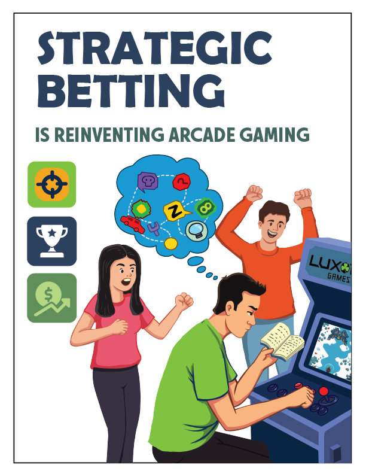
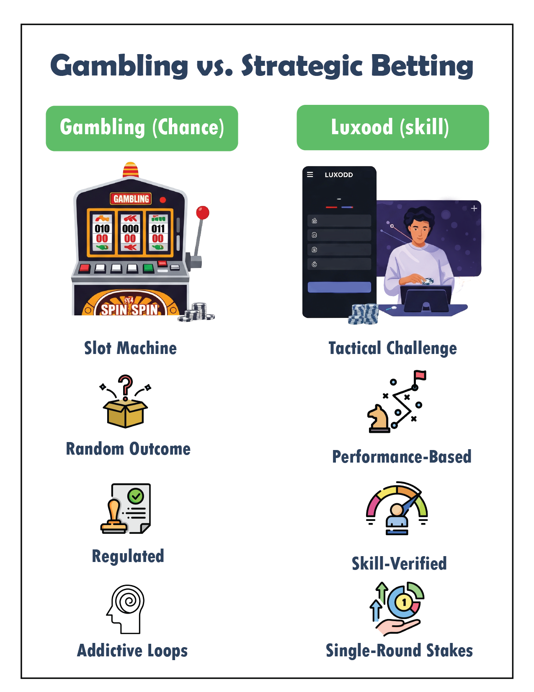
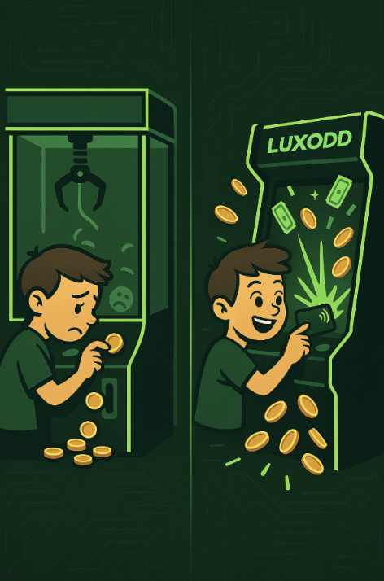

# Luxodd's Breakthrough in Strategic Betting™
## Is This the End of Gambling as We Know It?

Let's talk about what Luxodd is doing to the arcade world because it's big. We've developed something totally fresh: a patented system called Strategic Betting™, and it's flipping the entire idea of gambling on its head. No luck, no randomness, just skill!

Unlike traditional gambling where you're at the mercy of a spinning wheel or the roll of some digital dice, Luxodd games are all about what you can do. Think reflexes, timing, decision-making—your skills are what win the game, not chance.

So this isn't about mindlessly pumping quarters into a cabinet hoping for a payout. With Luxodd, players take on missions, unlock achievements, and dive into actual challenges where they control the outcome. And the best part? If you're good, you can walk away with real rewards.

In this deep article, we're going to break down exactly how it works, what makes it so different from traditional gambling, and why players, parents, investors, and arcade owners are all paying attention. 

Spoiler: it's not just another gimmick; it's a smarter, fairer, and way more fun approach to skill-based gaming.

## What Is Strategic Betting™ (and Why It's a Game-Changer)?

Here's the gist: Strategic Betting™ lets players bet on themselves. Not on a roulette wheel, not on a random card pull, but on their own performance in a game.

It's like this: Before starting a mission in one of our games (say, Tactical Storm), a player decides: "Alright, I'm feeling confident. I bet I can clear this level without losing a life." They put a small stake down and then dive into the mission.

If they nail it? They get a payout of actual $$. If not? They lose their money. Either way, the outcome is 100% up to them.

This is what sets Luxodd apart. You're not spinning a slot machine and hoping for luck. You're making decisions, assessing your abilities, and going in with a strategy. That layer of risk-reward, mixed with real gameplay, adds a thrill that traditional arcades just can't match.

And that's exactly what happens in Tactical Storm, our flagship game. Players go on intense tactical missions, choosing between playing it safe or betting on a flawless win. It's like a single-player e-sport session where you get more than just bragging rights…you get a reward that actually means something.

And yeah, we get it. The word "betting" sounds a little edgy. But hear us out...

## "Wait, isn't this just... gambling?"

This is the big question we always hear

Short answer? Nope. Not even close.

Here's why: There's a clear line—legally and logically—between games of skill and games of chance.

A game of chance? That's a lottery, a slot machine, or roulette. You pull the lever or press a button and hope the universe is in your favor. It's random. There's nothing you can do to get better at it.

A game of skill? That's Luxodd. Your outcome depends on your own reflexes, decisions, timing, and gameplay. You practice, you improve, and your chances of success go way up. That's not luck…that's merit.

In fact, regulators around the world recognize this distinction. Games of chance get hit with strict age limits, licenses, and restrictions, especially to protect minors. But skill-based competitions? They're often treated more like sports than gambling.

Take chess tournaments or esports; no one thinks of those as gambling, right? That's because they're not. They're competitions. That's exactly the model we've built Luxodd around.

We've even gone a step further by patenting the entire Strategic Betting™ system. That's how serious we are about protecting the integrity of skill-based play. It's not about tricks or flashing lights, it's about your skill vs. the challenge, every time.

## "Okay, But What About the Kids?"

Fair question, and we're ahead of you on that one.

Whenever people hear the word "bet" and "kids" in the same sentence, there's a gut reaction. And honestly? That's totally fair. A lot of parents are rightfully concerned about young people being exposed to gambling mechanics too early, especially in today's gaming world where microtransactions and loot boxes are everywhere.

But Luxodd isn't like that.

We've built guardrails into the system to make sure it's always fun and fair, and never exploitative.

Here's how:

- Fixed wagers only. There's no "double or nothing" spiral. Players place a bet before the game starts, and that's it. No endless retry loops. No escalating losses.
- Caps and cooldowns. Operators (or parents) can set limits on how often younger players can place bets or how much they can stake. This is made possible with the player profile feature we've implemented into all our systems!
- No chasing losses. The system doesn't let players throw money at the screen hoping to win it back. Each round is a clean slate.
- Transparency. Players always know what's at stake and how to win. No hidden odds or algorithms. If a mission says "complete in 60 seconds for 2x," that's exactly what it means.

And let's be honest: Kids already spend money in arcades. They buy tokens. They swipe cards. They try the claw machine ten times in a row hoping it actually grabs something. Luxodd just gives that spending some structure. Some strategy. Some actual reward for skill.

In fact, we'd argue that Luxodd helps teach kids good gaming habits. It rewards practice, persistence, and smart decision-making. It builds confidence. It's more like training for a tournament than spinning a wheel for luck.

Since their history gets etched into their individual profiles, parents can get involved, monitor activity, and set preferences. And because our machines are in public venues (not shady corners of the internet), there's always a layer of social oversight too.

At the end of the day, Luxodd is actually addressing a much bigger issue: kids being introduced to real gambling mechanics way too early. Research shows that even "harmless" betting (like loot boxes or chance-based arcade games) can increase the likelihood of problem gambling later in life (Massachusetts Gaming Commission, 2021)

Luxodd flips the script by removing chance and making the game about skill. Kids still get the thrill of playing for something, but without the danger of addiction or exploitation.

So yeah, parents can breathe easy. This isn't a gamble. It's a safer, smarter way to let kids play for keeps.

## A Win-Win for Investors: Solving a Problem and Scaling Fast

Let's zoom out for a second. Luxodd isn't just fun and ethically built, it's also a serious business opportunity. If you're an investor or thinking like one, here's why this matters.

We're hitting a massive sweet spot: solving a real societal problem while creating a fresh, scalable entertainment model. It's rare that a product is both morally forward and revenue-smart, but Luxodd is both.

So, let's talk numbers.

Traditional arcade cabinets have pretty limited earning potential. You're talking about a few quarters per play, maybe a few bucks per hour if you're lucky. Luxodd? We break that ceiling. Not only do players pay to start a game, they can also bet within the game. So suddenly, a single session isn't just one transaction—it's multiple.

Even better, players who are good (and confident) are more likely to take on higher stakes. And because the outcomes are skill-based, they stick around longer, come back more often, and spend more. Revenue scales with engagement.

And here's the kicker: 70% of revenue goes straight to venue operators. That's a massive cut, which gives arcades, bars, and family entertainment centers a real reason to bring in Luxodd. Developers get a share too (like an app store), and we at Luxodd take a slice for running the platform. Everybody wins. It's a true ecosystem.

And because we're a cloud-connected platform, this whole thing is built to scale like software. Want to add new games to your machine? Just download them.

We're not stuck in the old model of "buy a new arcade machine every time a new game comes out." That's clunky and expensive. With Luxodd, your cabinet is a living, evolving platform, just like your phone or gaming console.

That also means we can go global fast. Once a new game is out, it can roll out to every machine, everywhere, instantly. That's massive.

But here's what really seals the deal for investors: We're on the right side of the narrative. We're solving a growing public concern—kids and gambling exposure—while offering an experience that's high-energy, highly profitable, and totally responsible. That kind of alignment doesn't just make money. It builds trust and longevity.

## "Been to that cool spot round the corner?"

Let's talk cool factor. When word gets out that your venue has that machine—the one where people are betting on their skills, climbing leaderboards, and winning actual rewards—you're going to get noticed. 

It's got that sleek, high-tech vibe that today's players are looking for. Think of it like trivia night or poker night, except it's every night, and it's built into a machine that pays for itself.

Luxodd isn't just another cabinet. It's a content hub, a competition machine, and a crowd magnet, all rolled into one.

So what does this mean in practice?

Let's say you walk up to a Luxodd cabinet. Today, you might find Tactical Storm and a few other genres already loaded. A year from now? You might find a dozen games—from sports simulations to fantasy questing to brain-teasing puzzle marathons—each one offering smart betting hooks and deep gameplay. No fluff, no re-skinned slots. Just real games where your skill drives your reward.

And here's what that really achieves: it kills the argument that this is "just gambling with a game wrapped around it." When people see rich, genre-spanning titles with actual challenge and substance, they understand this is gaming. This is play. This is progress. And yes, you can win, but you've got to earn it.

Traditional arcade cabinets are losing relevance. You invest thousands in a box that earns pennies per hour and becomes outdated in months. If you're an operator, you've probably already seen it—fewer people playing, shorter sessions, more dust than dollars.

But now… Luxodd changes all of that.

Here's what happens when you install even one Luxodd cabinet:

- Your space becomes a magnet for people who want to play with purpose.
- Every single game played is based on skill, not luck, so players stay longer, spend smarter, and keep coming back.
- You, the operator, keep 70% of the revenue. That's not a typo. That's real money in your hands, not siphoned away by platform middlemen.

And here's what doesn't happen:
- ❌ No shady payouts.
- ❌ No parents storming in about "what their kid just spent."
- ❌ No legal headaches around gambling licenses or slot-machine grey zones.

With downloadable games, parental controls, patented tech, and a legal framework rooted in skill, Luxodd is the future you'd want to build if you were designing the next generation of arcades from scratch.

So if you're still wondering...

## "Is this just another flashy arcade fad?"

No. It's the first time in decades that an arcade platform:
- Solves a real problem
- Creates a brand-new revenue model
- And does it without compromising ethics

👀 Want in before everyone else catches on?

[Pre-Order Now At 30% OFF >>](https://landing-page-195979437523.us-west1.run.app/reservation) 
