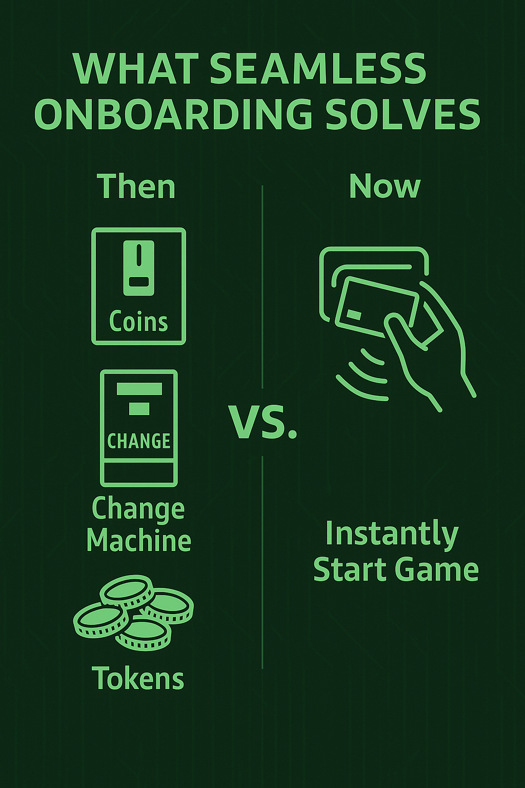

# Swipe Right into the Future

## Luxodd's Seamless POS & Credit Card Integration

Let's be honest… nobody misses the days of scrounging for tokens or standing in line to reload a plastic arcade card. In an age where you can tap your phone to buy coffee, why should playing a game still feel like a mini scavenger hunt?

That's exactly the question Luxodd asked and answered. With our seamless onboarding system, Luxodd makes jumping into an arcade game as easy as a tap.

How exactly have we made this possible? Read on to find out how our integrated payment system, player profiles, and lightning-fast startup experience are changing the game for players, operators, and developers alike.

<!-- truncate -->

## What Seamless Onboarding Solves

Walk into any arcade and you can spot the relics of gaming's past: coin slots taped over, change machines coughing up tokens, and confused newcomers wondering where to start.

Now picture the exact opposite: no tokens, no lines, no hassle. You stroll up to a cabinet, tap your credit card or phone, hear a friendly beep, and bam! you're in the game before your drink has a chance to sweat.

That one‑tap handshake is Luxodd's secret sauce, and it's changing everything.

## What it Used to Be Like…

You walk into an old‑school arcade. It's buzzing, glowing, and packed with machines. You're hyped to play… but first, it's time to hit up the change machine.

You dig in your pocket, feed in a crumpled bill, and get a fistful of tokens. Cool, right? Sure, until you run out mid‑game and have to go reload. Or worse, the machine jams. We've all been there.

Arcade techs practically carry utility belts just to keep things running. And even "upgraded" arcades that use digital cards often lock you into a single venue. You load money onto a Chuck E. Cheese card… but good luck using that at a different arcade down the block. It's like having a gym membership that only works at one location.

> "You mean I can just tap my credit card and play??"

Yes you can! Luxodd ensures all its game cabinets have their own payment terminal. You walk up, tap your card or phone, and boom, you're playing. No token machine. No proprietary card. No wait.

Whether it's a credit card, debit card, or digital wallet on your phone, Luxodd accepts it. The cabinet recognizes your tap, gives you a friendly beep, and launches the game. Just like that. You're not stuck in line. You're not waiting for a staff member. You're not trying to remember how many credits you have left. You're just in.

## A Real‑World Example: Meet Max

Let's say Max walks into a cool new arcade bar downtown. They spot a glowing Luxodd cabinet in the corner… maybe it's our slick space shooter, Tactical Storm... Instead of asking where to buy tokens, Max just taps a card. Beep. The screen comes to life, and the game's ready to go.

### Every Cabinet Recognizes Who You Are

And here's the real kicker: when you tap your card, you're not just starting a game. You're logging into your own account. Luxodd's global profile system means every cabinet recognizes who you are: your avatar, your progress, even your digital tickets and game currency.

Your gaming self goes with you wherever you find a Luxodd machine. If you're a console gamer, think Xbox Live or PlayStation Network. Luxodd is bringing that same magic to arcades.

### Let's Check Back In with Max

Remember our friend Max? After that first session at the arcade bar, Max heads across the country to visit family. While at the mall, there's another arcade – and what do you know, it's Luxodd‑equipped too.

Feeling nostalgic for that last adrenaline rush, Max taps his card again. The screen greets them: "Welcome back, Max!" Then, a prompt: "Last played: Tactical Storm Level 3. Continue?"

Now that is cool. Max can literally jump right back into the game, see lifetime stats, check for any outstanding Strategic Bet™ winnings, or just admire the scoreboard.

And here's the best part: Max didn't have to sign in, type a username, or even remember a password. The card did all the work. Behind the scenes, Luxodd uses a secure token system to match Max's tap to their global profile. No actual card data gets stored in the game… just a secure ID. To Max, it feels like magic.

> "Huh… this machine already knows me. Sweet!"

## Infographic Story: Max's One-Tap Arcade Journey

1. **Meet Max** – Ready for something new
2. **Spot** – Sees a sleek Luxodd machine outlined in neon green
3. **Tap** – Max taps his credit card (or scans code). Beep! Instant confirmation
4. **Play** – Games launch in seconds—no kiosks, no waits
5. **Win & Reward** – Completes the mission, unlocks achievements, and collects real money
6. **Repeat Anywhere** – Travels, taps a Luxodd cabinet, and picks up exactly where he left off
7. **Profile** – His avatar, progress, tickets, and wallet load automatically

## Why This Feels So Good (and Smart)

For players, it's crazy convenient. No lost progress, no duplicate accounts, and no hunting for paper tickets stuffed into old jeans. It's a subtle but powerful feeling… the system knows you, remembers your victories, and welcomes you back like a VIP. That kind of continuity builds loyalty. You're not just playing a machine – you're continuing your own arcade story.

## For Arcade Operators: Why This is a Big Deal

If you run or manage an arcade, you know the most important moment is that first game. That's where players decide if they're staying, buying snacks, inviting friends, or heading out. Luxodd makes that first play effortless. There's no hesitation or confusion, just instant engagement.

Imagine how many players don't play a game because they're unsure how the payment works, or don't want to wait in line. Luxodd clears that hurdle. Each cabinet becomes a self‑contained, always‑on, ready‑to‑go station.

## Operators & Investors – This Is Your Green Light

Alright, let's talk business for a minute. If you're running an arcade, or thinking about investing in one, here's what Luxodd's seamless onboarding means for you.

First up – more people are going to play. If someone walks in curious and can just tap their card and start playing, they're far more likely to give it a try. No line. No signup. No confusion. That low‑friction entry turns window shoppers into paying players. And each quick session? That's money in your pocket.

But the real goldmine here? Flexibility. Because it's all software‑based, you can do things like:

- Run time‑based promos (like "happy hour" discounts)
- Offer flat‑rate day passes or subscriptions
- Give loyalty bonuses for return visits
- Reward big spenders with bonus plays

Good luck managing that with a coin slot. With Luxodd, all of that is done digitally and can be managed from a dashboard, not a coin hopper.

And for developers? Luxodd makes arcade distribution as easy as publishing an app. If you've got a killer game idea, you can get it on Luxodd's network without manufacturing an entire cabinet. Just build for the platform and reach players around the world instantly.

## The Bottom Line

There are three big pieces of Luxodd's vision:

1. **Strategic Betting™** – Adds high‑stakes thrills to gameplay
2. **Social connectivity** – Turns individual play into a community event
3. **Seamless onboarding** – Lowers barriers and keeps the action flowing

On their own, each of these is cool. But together? They create something totally different. A new kind of arcade. One that's fast, fun, and built around the way people actually play today.

So next time you're out at an entertainment venue and see a Luxodd cabinet glowing in the corner, give it a try. Just walk up, tap your card, and see what happens. 