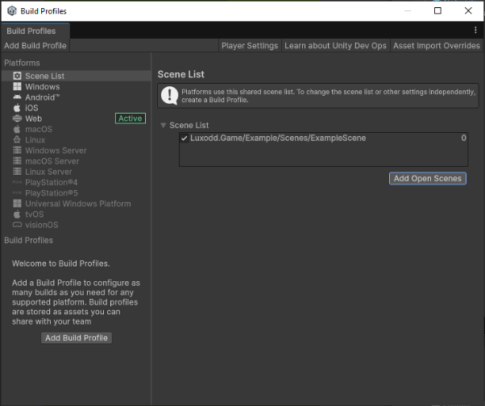
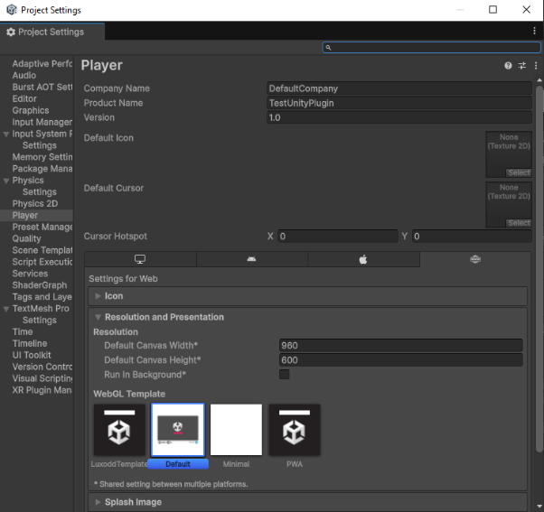
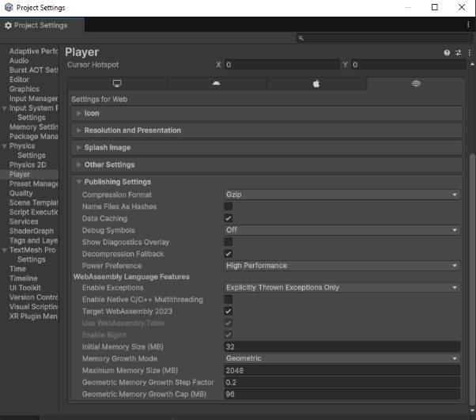
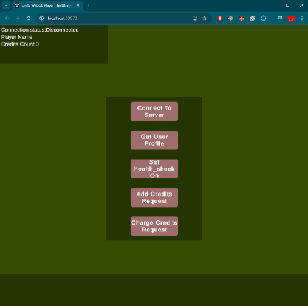

### **📁 Included WebGL Template**

Along with the main plugin source code, the plugin package includes a special folder containing a custom WebGL template (e.g., `LuxoddTemplate`).

This template is **essential** for properly building the game for arcade deployment as it contains crucial settings and structural adjustments.

### **🔧 Setting Up the Build**

To properly set up and verify the WebGL build:

1.  **Open Build Settings**

    - In the Unity Editor, navigate to the menu: `File` > `Build Settings`.

2.  **Select the Correct Scene**

    - Ensure that the correct game scene (e.g., ExampleScene) is selected and added to the Scenes In Build list.
      

3.  **Switch to WebGL Platform**

    - Confirm that the active platform is **WebGL**.
    - If not, click **Switch Platform** to convert the project to WebGL.

4.  **Configure Player Settings**
    - **a) Resolution and Presentation:**
      - Open **Player Settings** from Build Settings.
      - Under **Resolution and Presentation**, find the field **WebGL Template**.
      - Select **LuxoddTemplate** from the list of available templates.
        

- **b) Publishing Settings:**
  - Still in **Player Settings**, expand **Publishing Settings**.
  - Configure the settings exactly as shown in the provided reference screenshot.
    
  - (Make sure Compression, Data Caching, and other relevant options match.)

### Building and Running

Once setup is complete:

- Click **Build and Run** in the Build Settings window.

- Unity will compile the project and automatically open it in your default web browser once completed.

If everything was configured correctly, you should see the game running directly in the browser.



### Testing Plugin Functionality in Browser

To test the plugin connection:

1.  After the game loads in the browser, locate the URL in the address bar.
2.  After the port number, append the following query string:

    ```
    /index.html?token=your_dev_token
    ```

    - Replace `your_dev_token` with the developer token you received upon registration.

3.  Press Enter to reload the page with the provided token

✅ Now the plugin will operate correctly within the browser environment, allowing you to fully test server connections, arcade interactions, and the complete plugin lifecycle.
