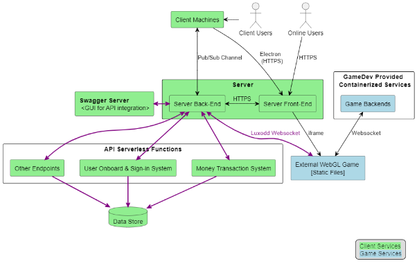

# High-level architecture

## Actors:

### Player

- After registration and login, the player will be logged in as a **Client User** at an arcade (Client Machine) or as an “Online User” via their own browser. Online users are given access to update their accounts online, but not play the games.

### Client Machine

- A physical arcade unit consisting of two different hardware configurations (specified below).

### Client Services

- Responsible for user authentication, account management, data synchronization between arcade units and the server, user registration, card management, balance top-ups, data collection, analytics, and launching games from the system.

### WebGL Game infrastructure

- Marked in light blue, representing the game and its own personal backend services.
