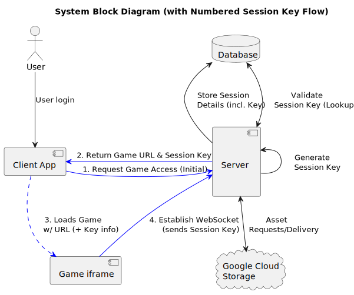

# High-level architecture

## Actors:

**Game Developers** - The Developer manages their own games on the [Luxodd Admin Portal](https://admin.luxodd.com)  , and will have access to test out the API commands on our [POSTMAN socket API interface](./websocket.mdx). When they onboard they can access the Server Front-End as a **Online User** w/ limited access to test their games on Luxodd after uploading.

**Local Players** - Players who are physically at the arcade. They will onboard and start playing games in various ways. Either register at the arcade using their credit card, or online with a browser.

**Online Users** - Players who need to manage their account. This can also be a Local Player leveraging their smart phone or computer. They can manage their personal account (check/add funds, update contact info, reset password or pin). Online users currently are restricted from playing online. Online play is on our roadmap as a service to offer.

**Merchants** - Merchants who own/host the physical arcade. They are empowered to select the games and price to play for each arcade on their specific arcades. They can showcase up to 5 games per arcade.

## Arcade

- A physical [arcade](hardware-specification.md) of two different varieties. Both connect to Luxodd Client Service infrastructure which enables the arcades to operate. Both are entirely dependent on being connected to the internet. On our roadmap is to enable them to have limited game play functionality when disconnected, only needing to connect up to process payments taken at their POS.

## Luxodd Client Services

- Marked in green, Client Services are Luxodd manged web infrastructure. Responsible for user authentication, account management, data synchronization between arcade units and the server, user registration, card management, balance top-ups, data collection, analytics, and launching games from the system.

## Game Services

- Marked in light blue, are game developer assets that are manged by the game developer. The Admin Portal manages the WebGL Game static files, and teh game developer can connect to external services for their games provide additional functionality. All external services much first be approved before they are allowed. 

## Game Server Functions

- The game server provides a suite of different capabilities. 

    - Hosts an IFRAME between the WEBGL game and the arcade. This enables the arcade to commuincate with the game and keep in control of its own session. Other things can be done with this such as time the game out, and provide new future capabilites directly from the server
    - Provides a Socket Gateway Api Service that enables webgl games to communicate with backend services hosted on the server. This includes integrations with our POS and payment gateway service, as well as ensuring that the system can pull the current users session data into the game. Session data includes session keys which highly restricts the access of the webgl to the current users session for this specific game. All games are only allowed to pull their own game session data and tailored only to the user whose session key is provided. Various other endpoints are provided, and documented in our [API Reference](unity-plugin/api-reference.md) page.
    - Provides a server side event (SSE) To identify clients when they connect to the system. It connects up with Pub/Sub infrastructure to secure its communications with the Arcade and to control its onboard hardware such as monitor location, Printer, and POS. The Pub/Sub communication on the Arcades, allows for the arcade to have limitless ways to for it to integrate new services quickly.

## Admin Functions

- The two primary admin functions are to upload new games to the system and walk the developer through the onboarding process. It is also used by Merchants to manage games seen on their arcade. It will additionally provide metrics and statistics on players, games, income, and general performance.

## Game Launch Session Token

The game launch system enables our system to ensure least privilege of any game is leveraged by only allowing the webgl game to access a players session token. The session token narrows permissions of a deployed webgl game to simply ONLY be able to access a user's data in a snapshot in time (the life of the session -- which is as long as the game is being played). It additionally keeps any data from being too generic data about the system, and only allows data about the user's use of the game to be be pulled.

Generically the game issues a URL session key when the player is logged in. And that key is then used in the URL of the iframe which hosts the game being played.

This session key, the same API token that is issued to a developer to test their backend sessions. Think of it as an never expiring session key specifically built for this game and the developer's account.