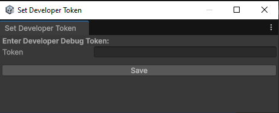
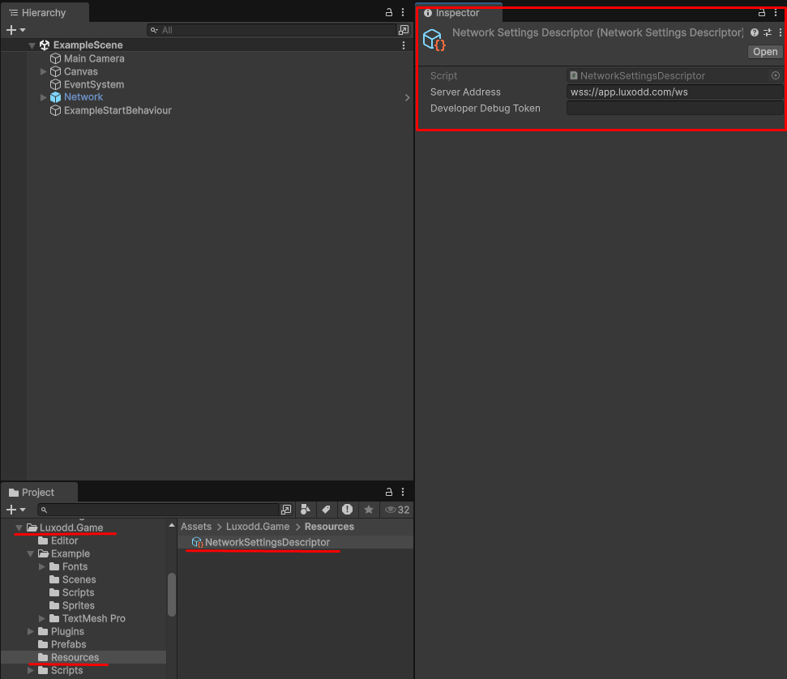

# Configuration Guide

## Developer Token
To enable Debug Mode, enter your developer token:
1. Navigate to: Tools > Luxodd Plugin > Set Developer Token
2. Paste the token obtained during registration

## Server Environments
The plugin supports two environments:
- Staging (default, for testing)
- Production

To configure, edit the file at: `Assets/Luxodd.Game/Resources/NetworkSettingsDescriptor`

## Next Steps
- [Test the integration](./testing.md)
- [Start integrating the plugin](./integration.md) 