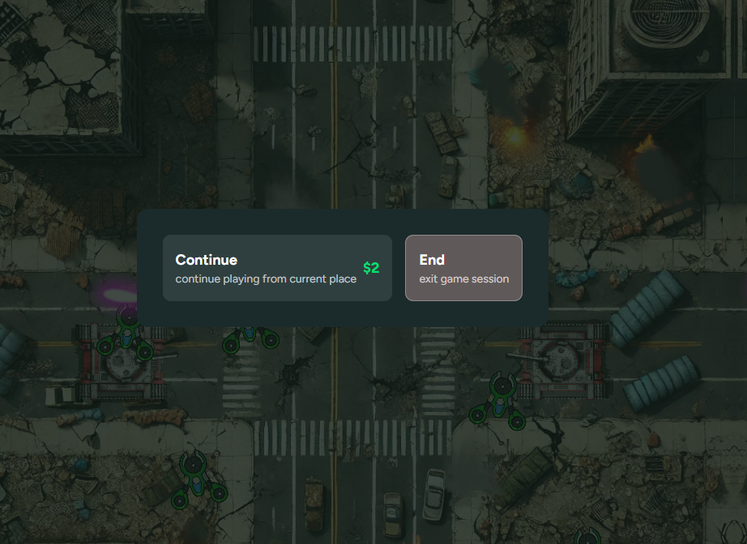
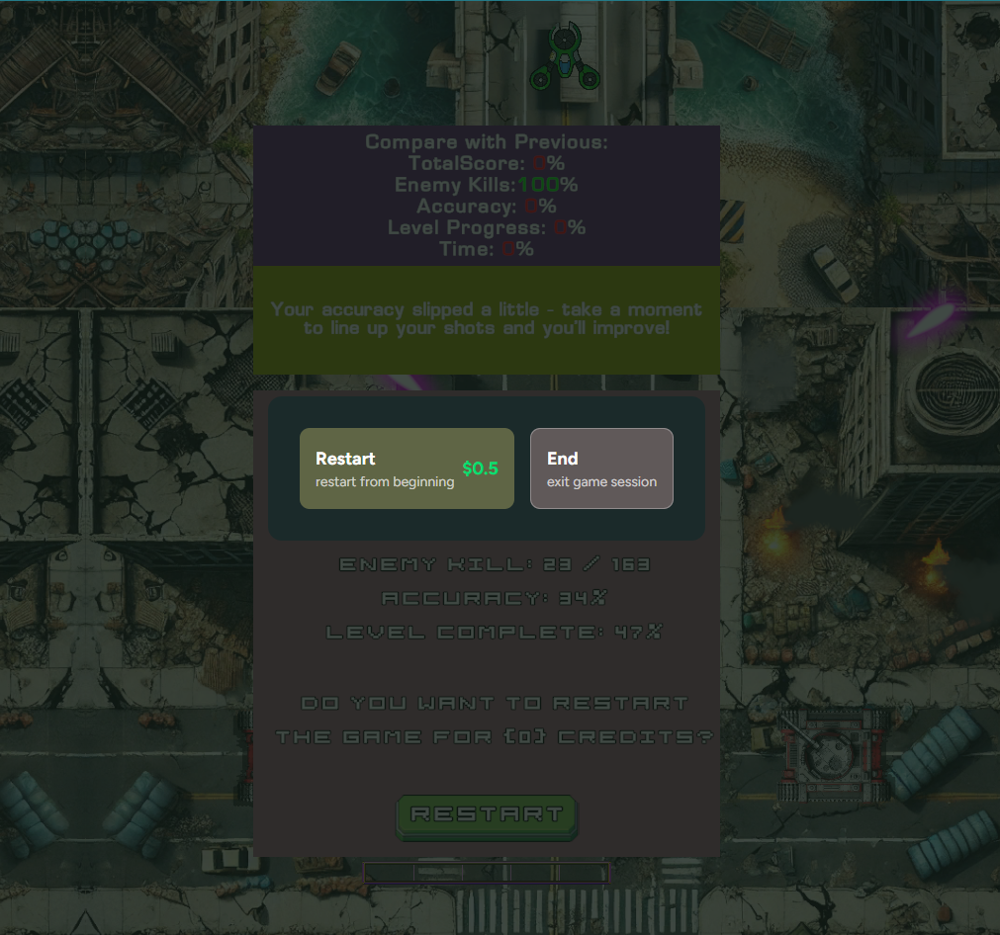
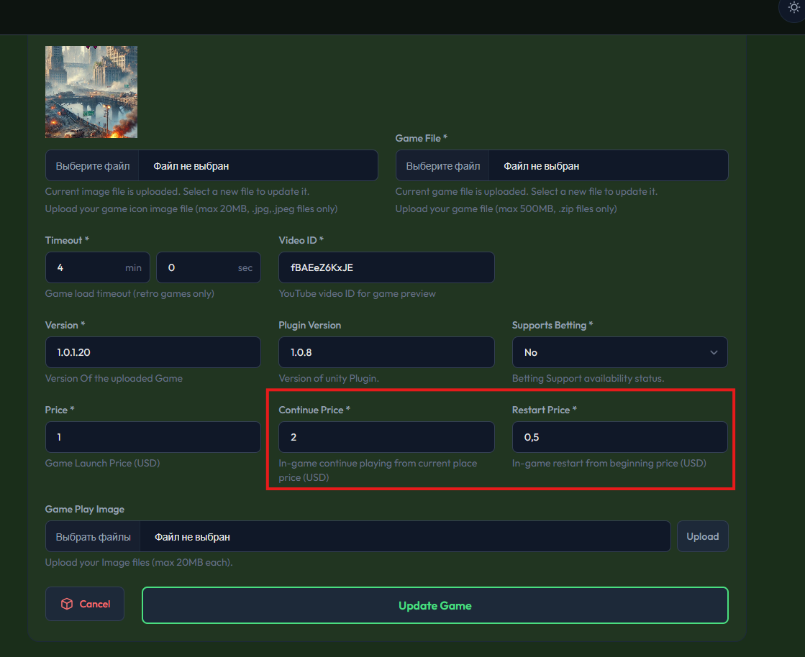
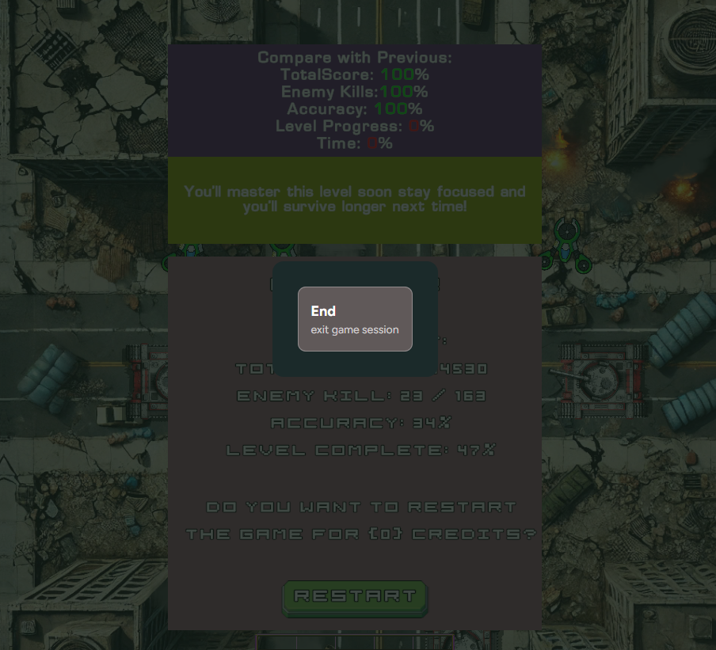

# In-Game Transactions

## 1. Overview

**In-Game Transactions** provide a seamless way to work with player credits directly inside the game, without forcing the player to leave the gameplay flow or return to the system UI.

This mechanism is designed to:

- preserve player immersion,
- support paid gameplay scenarios,
- ensure session data integrity,
- maintain a smooth and predictable user experience.

---

## 2. Core Concept

In-Game Transactions are built around **two intentionally separate flows**:

- **Continue**
- **Restart**

Although these options may appear similar visually, they represent **fundamentally different session states** and must be handled differently.

---

## Key Definitions

### Game Session

A **game session** represents a single continuous run of gameplay and includes:

- progress,
- score,
- time played,
- achievements,
- any other session-specific metrics.

How a session is finalized depends on whether the player **continues** or **restarts** the game.

---

## Transaction Types

### Continue



The **Continue popup** is used when the player can resume the **same game session** by spending credits.

Typical use cases:

- restoring lives,
- extending time,
- resuming from the last checkpoint.

**Characteristics:**

- The session is **not finalized**.
- Gameplay continues within the same session.
- All continuation logic is handled by the **game**.

**Buttons:**

- Continue
- End

---

### Restart



The **Restart popup** is used when the player starts a **new game session** from the beginning, without leaving the game.

**Characteristics:**

- The current session **must be finalized before restart**.
- A new session is created by the **system**.
- The game does not manually restart or reinitialize the session.

**Buttons:**

- Restart
- End

---

## Responsibility Matrix

| Action                     | Game | System |
| -------------------------- | ---- | ------ |
| Pause gameplay             | ✅   |        |
| Resume gameplay (Continue) | ✅   |        |
| Restore lives / time       | ✅   |        |
| Show Continue popup        | ✅   |        |
| Handle Continue logic      | ✅   |        |
| Send session results       | ✅   |        |
| Show Restart popup         | ✅   |        |
| Create new session         |      | ✅     |
| Restart session            |      | ✅     |
| Balance & credit checks    |      | ✅     |
| Top-up flow                |      | ✅     |

---

## 3. Why Continue and Restart Are Separate Flows

Continue and Restart represent **different session lifecycles**.

- **Continue** keeps the current session active.
- **Restart** finalizes the session and creates a new one.

At the moment a popup is displayed, the player’s choice is **unknown**.  
Finalizing a session too early can lead to:

- lost session data,
- incorrect statistics,
- broken paid gameplay flows.

For this reason:

- Continue logic is handled by the **game**.
- Restart logic is handled by the **system**, after session results are safely sent.

This separation is intentional and required for data safety.

---

## 4. Example Game Genres & Usage

### Vertical Top-Down Shooter

- Player starts with limited lives.
- Lives are depleted during gameplay.

**Continue**

- Player restores lives.
- Session continues.

**Restart**

- Session is finalized.
- New session starts from the beginning.

---

### Puzzle Game (e.g. 2048)

- No natural continuation.
- Only restart is supported.

**Usage**

- Restart popup only.

---

### Racing Game

- Time- or lap-based gameplay.

**Continue**

- Extend race time or resume from checkpoint.

**Restart**

- Restart race from the beginning.

---

## 5. Preconditions Before Integration

### For Continue

- Ability to pause gameplay systems.
- Ability to resume gameplay safely.
- Ability to restore session-specific state.
- Ability to handle cancellation (End).

### For Restart

- Ability to finalize session results.
- Ability to show session summary.
- Ability to cleanly exit gameplay.

---

## 6. API Integration

### Available Methods

```csharp
public void SendSessionOptionContinue(Action<SessionOptionAction> callback);
public void SendSessionOptionRestart(Action<SessionOptionAction> callback);

public enum SessionOptionAction
{
    Restart,
    Continue,
    End
}
```

## 7. Unity Integration Example (Step-by-step)

This section shows a **minimal, working** integration example for Unity and explains **where to place** it and **how to use it.**

### Where to put this code

Recommended structure:

- Create a script called `InGameTransactionController.cs`
- Place it in: `Assets/Scripts/Gameplay/` (or similar)
- Attach it to a scene object that exists during gameplay, e.g. `GameManager` or `GameplayRoot`

### What you need in the scene

You need references to:

- `WebSocketService` (plugin service)
- `WebSocketCommandHandler` (to send session results)

These are usually created/bound by your plugin bootstrap / DI.

If you don’t use DI, you can assign them via Inspector (as shown below).

---

### Minimal working example (Unity C#)

This section demonstrates a minimal, production-ready integration example for Unity
and explains how to correctly use In-Game Transactions in a real game project.

:::note
This example assumes you already detect **Game Over** in your gameplay.
:::

```csharp
using System;
using UnityEngine;
using Luxodd.Game.Scripts.Network;

public class InGameTransactionController : MonoBehaviour
{
    [Header("Plugin references")]
    [SerializeField] private WebSocketService _webSocketService;
    [SerializeField] private WebSocketCommandHandler _webSocketCommandHandler;

    // Call this from your gameplay when the run ends (0 lives, timer expired, etc.)
    public void OnGameOver(bool allowContinue, bool allowRestart)
    {
        // 1) Freeze/pause gameplay first (VERY IMPORTANT)
        PauseGameplay();

        // 2) Choose which popup you want to show based on your game design.
        // Typically you show ONE popup:
        // - Continue OR Restart (not both at the same time)
        if (allowContinue)
        {
            ShowContinuePopup();
            return;
        }

        if (allowRestart)
        {
            ShowRestartPopup();
            return;
        }

        // If neither is supported, finish the session normally
        EndSessionAndReturnToSystem();
    }

    private void ShowContinuePopup()
    {
        _webSocketService.SendSessionOptionContinue(OnContinuePopupResult);
    }

    private void OnContinuePopupResult(SessionOptionAction action)
    {
        Debug.Log($"[Continue Popup] Player choice: {action}");

        switch (action)
        {
            case SessionOptionAction.Continue:
                // Player paid credits -> you must implement continuation logic
                ResumeGameplayWithContinueBonus();
                break;

            case SessionOptionAction.End:
                // Player ended the run -> send results + return to system
                EndSessionAndReturnToSystem();
                break;

            default:
                // Safety fallback (shouldn’t happen, but keep stable behavior)
                EndSessionAndReturnToSystem();
                break;
        }
    }

    private void ShowRestartPopup()
    {
        // IMPORTANT:
        // Before showing Restart popup you MUST send session results.
        _webSocketCommandHandler.SendLevelEndRequestCommand(() =>
        {
            // After results are safely sent, show Restart popup
            _webSocketService.SendSessionOptionRestart(OnRestartPopupResult);
        });
    }

    private void OnRestartPopupResult(SessionOptionAction action)
    {
        Debug.Log($"[Restart Popup] Player choice: {action}");

        // NOTE:
        // If player selects Restart, the system starts a new session automatically
        // and your game will NOT receive a callback for the Restart choice.
        //
        // You usually only receive callback when player selects End.
        if (action == SessionOptionAction.End)
        {
            _webSocketService.BackToSystem();
        }
    }

    private void EndSessionAndReturnToSystem()
    {
        // Send results first, then return control to system UI/platform
        _webSocketCommandHandler.SendLevelEndRequestCommand(() =>
        {
            _webSocketService.BackToSystem();
        });
    }

    // -------------------------
    // Game-specific helpers
    // -------------------------

    private void PauseGameplay()
    {
        // Implement in your game:
        // - stop enemies, bullets, movement, timers
        // - block input
        // - pause animations if needed
        Time.timeScale = 0f; // example only (not always recommended for all games)
    }

    private void ResumeGameplayWithContinueBonus()
    {
        // 1) Restore time scale / unpause systems
        Time.timeScale = 1f;

        // 2) Implement your game rules:
        // - add lives
        // - restore HP
        // - give extra time
        // - respawn at checkpoint, etc.
        //
        // IMPORTANT: this is GAME responsibility
        Debug.Log("Continuing the same session: restoring gameplay state...");
    }
}

```

## How you should use this

### Step 1 - Add the controller

- Add `InGameTransactionController` to your gameplay scene.
- Assign `WebSocketService` and `WebSocketCommandHandler` (Inspector or DI).

### Step 2 - Call it at Game Over

In your existing Game Over logic (example):

```csharp
// Somewhere in your GameManager:
_transactionController.OnGameOver(
    allowContinue: true,   // if your game supports continue
    allowRestart: true     // if your game supports restart
);
```

### Step 3 - Implement your Continue behavior

Edit `ResumeGameplayWithContinueBonus()` to match your game:

- restore 2 lives
- restore 10 seconds
- respawn at safe point
- etc.

---

## 8. Integration Flow

### Continue Flow

1. Detect Game Over.
2. Pause gameplay.
3. Call `SendSessionOptionContinue`.
4. Player chooses:
   - **Continue** → resume gameplay.
   - **End** → send results → return to system.

---

### Restart Flow

1. Detect Game Over.
2. Send session results.
3. Call `SendSessionOptionRestart`.
4. Player chooses:
   - **Restart** → system creates a new session.
   - **End** → return to system.

:::note
_Note_: Restart does **not** return a callback on success.
:::

---

## 9. Admin Panel Configuration



### Continue Popup

- Set **Continue Price > 0**.
- Supports fractional values (e.g. 0.5, 0.01)
- 0 disables the popup.

### Res Popup

- Set **Restart Price > 0**.
- Supports fractional values (e.g. 0.5, 0.01)
- 0 disables the popup.

---

## 10. Verification Checklist

- Game supports Continue and/or Restart.
- Correct popup method is used.
- Session results are sent at the correct time.
- Admin Panel prices are configured.
- End action is handled correctly.
- No manual restart logic is implemented.

---

## 11. Common Integration Pitfalls

The following issues may occur during integration and should be carefully avoided:

- Treating Continue and Restart as the same flow.
- Sending session results after showing the Restart popup.
- Expecting a callback for Restart.
- Handling Continue logic on the system side.
- Finalizing a session before the player makes a choice.

---

## 12. FAQ

**What happens if Continue price is set to 0?**

Only the **End** button will be shown.



**Do I need to handle credit logic?**

No. All credit checks and top-up flows are handled by the system.

**Can Continue and Restart be unified?**

No. This may lead to session data loss and is not supported.
