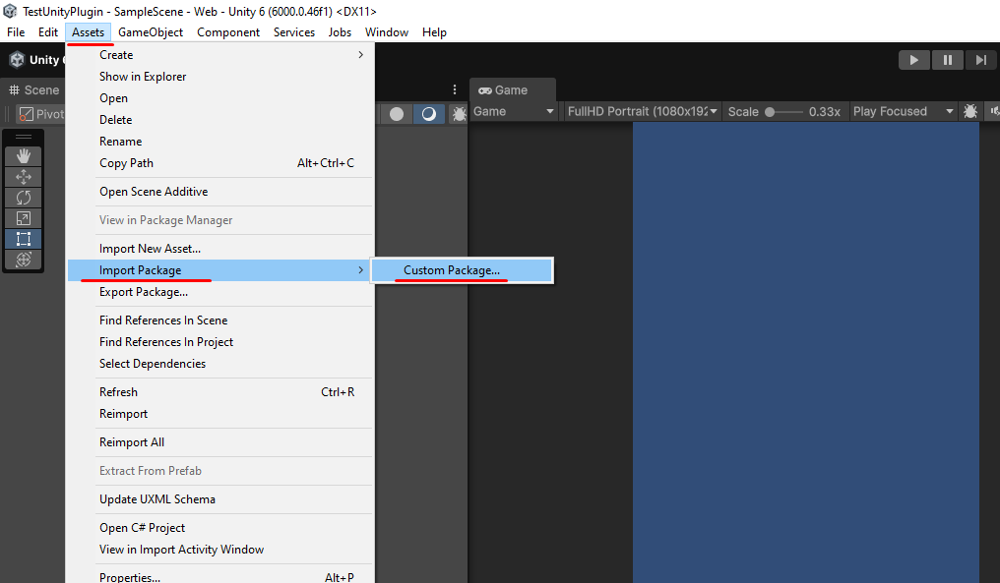
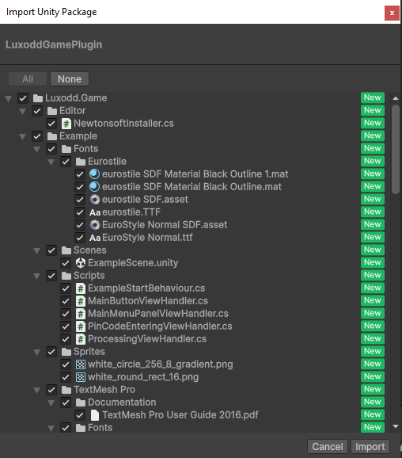
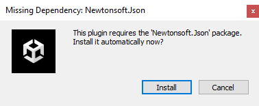
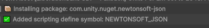

# Installation Guide

## Step 1: Download the Latest Unity Plug-in 
this [plug-in](https://github.com/luxodd/unity-plugin/releases) .unitypackage is just about all you'll need to get your game integrated with Luxodd.

## Step 2: Import into Unity
1. Open your Unity project
2. Navigate to: Assets > Import Package > Custom Package
3. Select the downloaded .unitypackage and click Open
4. In the "Import Unity Package" window, review the contents and click Import

## Step 3: Install Dependencies
If prompted, install the Newtonsoft.Json package. The plugin uses this library for JSON parsing.

If the prompt doesn't appear, it may already be installed in your project.

## Next Steps
- [Configure your development environment](./configuration.md)
- [Test the integration](./testing.md) 