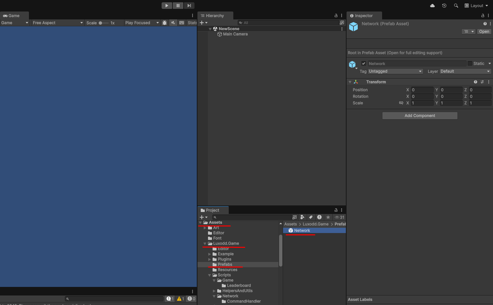

# Integration Guide

Below are the required steps and code changes to integrate your game into our system:

## 1. Add Plugin Prefab

Drag the Network prefab to your scene: `Assets/Luxodd.Game/Prefabs/Network`
This prefab contains all essential components to initialize the plugin.

## 2. WebSocket Connection

Use WebSocketService to connect to the server:

```csharp
// Remember to add the following using statement to the top of your class.
// This will give you access to all the plugin classes and services
using Luxodd.Game.Scripts.Network;
using UnityEngine;

public class ConnectToServerTest : MonoBehaviour
{
    [SerializeField] private WebSocketService _webSocketService;

    public void ConnectToServer()
    {
        _webSocketService.ConnectToServer(
            ()=> Debug.Log("Connected to server successfully!"),
            ()=> Debug.LogError("Connecting to server failed!"));
    }
}
```

:::tip
Establishes a WebSocket connection to the server and prepares the plugin for command exchange.
:::

## 3. Health Status Check

After the game connects to the server, enable the health status check command by using HealthStatusCheckService and its Activate/Deactivate methods:

```csharp
// Remember to add the following using statement to the top of your class.
// This will give you access to all the plugin classes and services
using Luxodd.Game.Scripts.Network;

public class HealthStatusCheckServiceTest : MonoBehaviour
{
    [SerializeField] private HealthStatusCheckService _healthStatusCheckService;

    public void ActivateHealthStatusCheck()
    {
        _healthStatusCheckService.Activate();
    }

    public void DeactivateHealthStatusCheck()
    {
        _healthStatusCheckService.Deactivate();
    }
}
```

:::tip
By default, the command is sent every 2 seconds. You can change this interval in the service script within the prefab in the Unity Editor.

:::

:::note
The deactivation method is primarily used to verify that the server correctly responds to the absence of health check status messages and properly handles this scenario.
This allows you to test and ensure that the server behaves as expected when health checks are stopped.
:::

## 4. Obtaining Player Profile Data

Use the command to request basic player info such as username and profile data:

```csharp
// Remember to add the following using statement to the top of your class.
// This will give you access to all the plugin classes and services
using Luxodd.Game.Scripts.Network.CommandHandler;
using UnityEngine;

public class PlayerProfileRequestTest : MonoBehaviour
{
    [SerializeField] private WebSocketCommandHandler _webSocketCommandHandler;

    public void GetPlayerProfile()
    {
        _webSocketCommandHandler.SendProfileRequestCommand(OnPlayerProfileRequestSuccessHandler, 
            OnPlayerProfileRequestFailureHandler);
    }

    private void OnPlayerProfileRequestSuccessHandler(string playerName)
    {
        Debug.Log($"Player Profile Request success: {playerName}");
    }

    private void OnPlayerProfileRequestFailureHandler(int code, string message)
    {
        Debug.Log($"Player Profile Request Failure: {code}: {message}");
    }
}
```

## 5. Obtaining the Player's Credit Balance

Use the command to retrieve the player's current credit balance:

```csharp
// Remember to add the following using statement to the top of your class.
// This will give you access to all the plugin classes and services
using Luxodd.Game.Scripts.Network.CommandHandler;
using UnityEngine;

public class UserBalanceRequestTest : MonoBehaviour
{
    [SerializeField] private WebSocketCommandHandler _webSocketCommandHandler;

    public void GetUserBalanceRequest()
    {
        _webSocketCommandHandler.SendUserBalanceRequestCommand(OnUserBalanceRequestSuccessHandler, 
            OnUserBalanceRequestFailureHandler);
    }

    private void OnUserBalanceRequestSuccessHandler(int credits)
    {
        Debug.Log($"User Balance Request success: {credits}");
    }

    private void OnUserBalanceRequestFailureHandler(int code, string message)
    {
        Debug.Log($"User Balance Request Failure: {code}: {message}");
    }
}
```

## 6. Tracking Game Events

At the beginning of each level, send the command that notifies the system that the player has started a level.:

```csharp
// Remember to add the following using statement to the top of your class.
// This will give you access to all the plugin classes and services
using Luxodd.Game.Scripts.Network.CommandHandler;
using UnityEngine;

public class TrackingGameEventsTest : MonoBehaviour
{
    [SerializeField] private WebSocketCommandHandler _webSocketCommandHandler;

    public void TrackLevelBeginRequest(int levelNumber)
    {
        _webSocketCommandHandler.SendLevelBeginRequestCommand(levelNumber, OnLevelBeginRequestSuccessHandler, 
            OnLevelBeginRequestFailureHandler);
    }

    private void OnLevelBeginRequestSuccessHandler()
    {
        Debug.Log("Level Begin Request success");
    }

    private void OnLevelBeginRequestFailureHandler(int code, string message)
    {
        Debug.Log($"Level Begin Request Failure: {code}: {message}");
    }
}
```

At the end of each level or during game over, make sure to send:

```csharp
// Remember to add the following using statement to the top of your class.
// This will give you access to all the plugin classes and services
using Luxodd.Game.Scripts.Network.CommandHandler;
using UnityEngine;

public class TrackingGameEventsTest : MonoBehaviour
{
    [SerializeField] private WebSocketCommandHandler _webSocketCommandHandler;

    public void TrackLevelEndRequest(int levelNumber, int score)
    {
        _webSocketCommandHandler.SendLevelEndRequestCommand(levelNumber, score, OnLevelEndRequestSuccessHandler, 
            OnLevelEndRequestFailureHandler);
    }

    private void OnLevelEndRequestSuccessHandler()
    {
        Debug.Log("Level End Request success");
    }

    private void OnLevelEndRequestFailureHandler(int code, string message)
    {
        Debug.Log($"Level End Request Failure: {code}: {message}");
    }
}
```

## 7. Credit Operations (Optional)

If your game requires various operations with in-game currency, use the following:

Add credits to a player (if the player does not have enough credits for an operation):

```csharp
// Remember to add the following using statement to the top of your class.
// This will give you access to all the plugin classes and services
using Luxodd.Game.Scripts.Network.CommandHandler;
using UnityEngine;

public class CreditsOperationTest : MonoBehaviour
{
    [SerializeField] private WebSocketCommandHandler _webSocketCommandHandler;

    public void AddBalanceRequest(int creditsAmount, int pinCode)
    {
        _webSocketCommandHandler.SendAddBalanceRequestCommand(creditsAmount, pinCode, OnAddBalanceSuccessHandler, 
            OnAddBalanceFailureHandler);
    }

    private void OnAddBalanceSuccessHandler()
    {
        Debug.Log("Add Balance Request success");
    }

    private void OnAddBalanceFailureHandler(int code, string message)
    {
        Debug.Log($"Add Balance Request Failure: {code}: {message}");
    }
}
```

Deduct credits from a player (for in-game purchases, unlocking content, etc.):

```csharp
// Remember to add the following using statement to the top of your class.
// This will give you access to all the plugin classes and services
using Luxodd.Game.Scripts.Network.CommandHandler;
using UnityEngine;


public class CreditsOperationTest : MonoBehaviour
{
    [SerializeField] private WebSocketCommandHandler _webSocketCommandHandler;

    public void ChargeUserBalanceRequest(int creditsAmount, int pinCode)
    {
        _webSocketCommandHandler.SendAddBalanceRequestCommand(creditsAmount, pinCode, OnChargeUserBalanceSuccessHandler, 
            OnChargeUserBalanceFailureHandler);
    }

    private void OnChargeUserBalanceSuccessHandler()
    {
        Debug.Log("Charge User Balance Request success");
    }

    private void OnChargeUserBalanceFailureHandler(int code, string message)
    {
        Debug.Log($"Charge User Balance Request Failure: {code}: {message}");
    }
}
```

:::tip
Deducts credits from the player's account. Used for retrying or continuing gameplay.
:::

:::note
Always display a popup for PIN code input before credit-related operations.

Errors:

- Incorrect PIN → error code 412
- Balance less then required → error code 402
- Other credit errors → error code 500
  :::

## 8. Leaderboards

To generate the leaderboard, it is mandatory to send the commands described in Step 6, particularly SendLevelEndRequestCommand with the player's score as one of the parameters.

If everything is done correctly and the end-of-level command is sent successfully with the score, a leaderboard will be formed on the server.

To fetch the leaderboard, use:

```csharp
// Remember to add the following using statement to the top of your class.
// This will give you access to all the plugin classes and services
using Luxodd.Game.Scripts.Game.Leaderboard;
using Luxodd.Game.Scripts.Network.CommandHandler;
using UnityEngine;


public class LeaderboardsRequestTest : MonoBehaviour
{
    [SerializeField] private WebSocketCommandHandler _webSocketCommandHandler;

    public void LeaderboardsRequest()
    {
        _webSocketCommandHandler.SendLeaderboardRequestCommand(OnLeaderboardsSuccessHandler, 
            OnLeaderboardsFailureHandler);
    }

    private void OnLeaderboardsSuccessHandler(LeaderboardDataResponse response)
    {
        Debug.Log("Charge User Balance Request success");
        Debug.Log($"Current user rank: {response.CurrentUserData.Rank}, score: {response.CurrentUserData.TotalScore}");
        Debug.Log($"Total leaderboards records: {response.Leaderboard.Count}");
    }

    private void OnLeaderboardsFailureHandler(int code, string message)
    {
        Debug.Log($"Charge User Balance Request Failure: {code}: {message}");
    }
}
```

`SendLeaderboardRequestCommand` — this command sends a request to retrieve the leaderboard for the game. It accepts a callback method with a LeaderboardDataResponse argument. LeaderboardDataResponse is a DTO that contains the response data for the leaderboard. What does it include?
- `public LeaderboardData CurrentUserData {get; set;}` — information about the current player
- `public List<LeaderboardData> Leaderboard {get; set;}` — a list of other players in the leaderboard

`LeaderboardData` is also a DTO that contains the specific data for each leaderboard entry.
What data does it include?
- `int Rank` — the player's position in the leaderboard
- `string PlayerName` — the player's name
- `int TotalScore` — the number of points (this is the highest score among all records for the specified player)


:::tip
Fetches the latest leaderboard data to show top players and their ranks.
:::

## 9. User State (Optional)

If your game needs to save any player state (such as settings, current level, level completion status, purchases, completed missions, etc.), use these commands to get and set user state:

```csharp
// Remember to add the following using statement to the top of your class.
// This will give you access to all the plugin classes and services
using Luxodd.Game.Scripts.Network.CommandHandler;
using UnityEngine;

public class UserStateRequestTest : MonoBehaviour
{
    [SerializeField] private WebSocketCommandHandler _webSocketCommandHandler;

    public void UserStateRequest()
    {
        _webSocketCommandHandler.SendGetUserDataRequestCommand(OnUserStateRequestSuccessHandler, 
            OnUserStateRequestFailureHandler);
    }

    private void OnUserStateRequestSuccessHandler(object response)
    {
        var result = response == null ? "null" : response.ToString();
        Debug.Log($"Charge User Balance Request success, data:{result}");
    }

    private void OnUserStateRequestFailureHandler(int code, string message)
    {
        Debug.Log($"Charge User Balance Request Failure: {code}: {message}");
    }
}
```

:::tip
Requests the user state from the server. On the first request, the value may be `null` if no state is stored yet.
:::

```csharp
// Remember to add the following using statement to the top of your class.
// This will give you access to all the plugin classes and services
using Luxodd.Game.Scripts.Network.CommandHandler;
using Newtonsoft.Json;
using UnityEngine;


public class UserStateRequestTest : MonoBehaviour
{
    [SerializeField] private WebSocketCommandHandler _webSocketCommandHandler;

    public void UserStateRequest()
    {
        var userState = new UserState()
        {
            CurrentLevel = 1,
            SkinId = 1,
        };
        
        var userStateRaw = JsonConvert.SerializeObject(userState);
        
        _webSocketCommandHandler.SendSetUserDataRequestCommand(userStateRaw, OnSetUserStateRequestSuccessHandler, 
            OnUserStateRequestFailureHandler);
    }

    private void OnSetUserStateRequestSuccessHandler()
    {
        Debug.Log("Charge User Balance Request success");
    }

    private void OnUserStateRequestFailureHandler(int code, string message)
    {
        Debug.Log($"Charge User Balance Request Failure: {code}: {message}");
    }
}

public class UserState
{
    public int CurrentLevel { get; set; }
    public int SkinId { get; set; }
}
```

:::tip
Sends a new user state object to the server to be saved. Can be used to persist user-specific parameters.
:::

:::note

### Tips for Using User State

- It is recommended to use a simple class containing primitive types (`int`, `float`, `string`) that can be easily serialized into JSON.
- For more flexible or dynamic data structures, use:
  `csharp
    Dictionary<string, object> userData
    `
  This key–value format makes it easier to handle complex state updates and partial modifications.
  :::

## 10 Input and Navigation

Please remember that your game will run on an arcade machine, so all UI navigation will be handled using a joystick and 6 arcade buttons.
Therefore, you need to implement button selection and activation logic in your game.
This functionality is not included in the Unity Plugin, since implementation approaches may vary.
However, you can refer to our sample game for guidance, including descriptions of the approaches we used.

- Link to the sample game description: [link to document]
- Link to the repository and specifically to the class responsible for this functionality: [link]

## Next Steps

- [Review API documentation](./api-reference.mdx)
