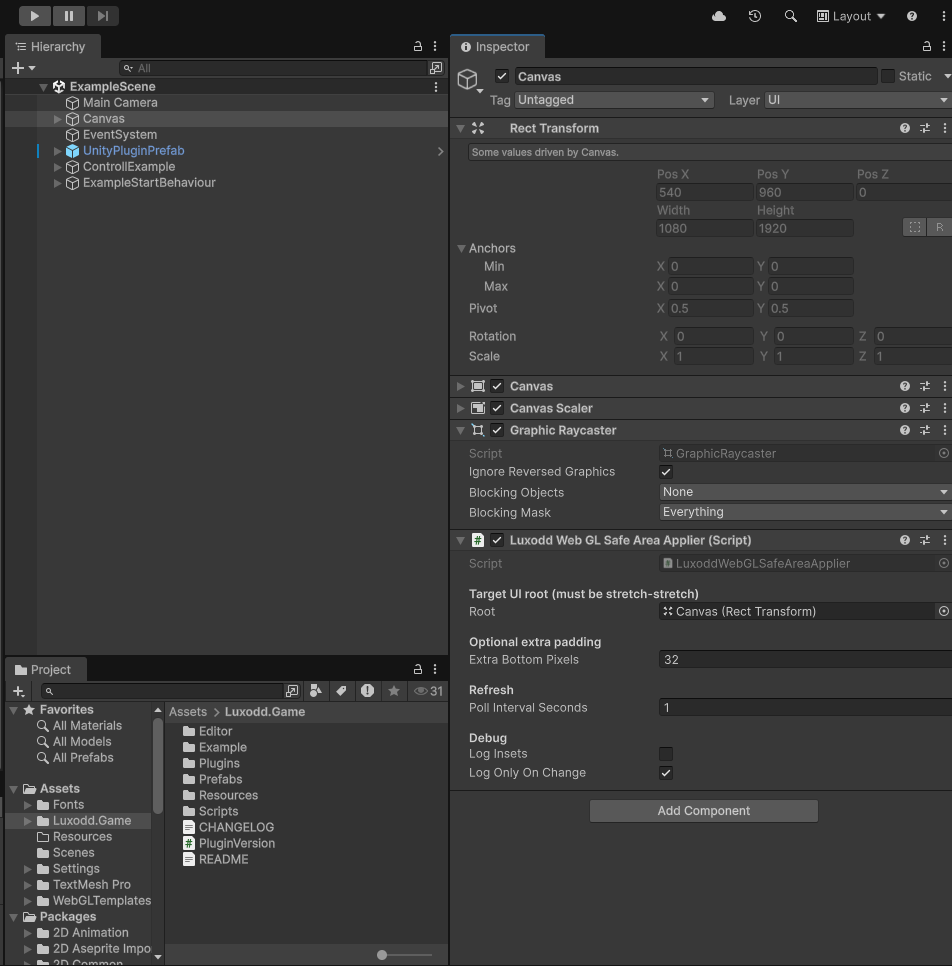

# Mobile-Friendly WebGL

This section explains how to make your Unity WebGL game mobile-friendly using the Luxodd Unity Plugin.

The plugin provides:

- Mobile runtime detection
- Visual viewport integration
- Safe area handling for mobile browsers
- Orientation and resize detection

This allows your game to adapt UI and UX behavior depending on whether it is launched:

- From an arcade machine
- From a mobile browser
- From a desktop browser

## Why This Matters

Mobile browsers dynamically change the visible viewport due to browser UI elements such as the address bar.

If not handled correctly, this may cause:

- Bottom UI elements to be clipped
- Incorrect scaling
- Inconsistent layout behavior in embedded builds

:::note
Mobile UI issues in WebGL are usually caused by the browser viewport, not Unity.
:::

## Detecting Mobile Runtime

You can check whether the game is running on mobile using:

```csharp
if (LuxoddRuntimeContext.IsMobileRuntime)
{
    // Apply mobile-specific UI or control logic
}
```

The plugin internally uses browser runtime information in WebGL builds to determine this.

## Handling Safe Area

To ensure that important UI elements such as bottom buttons are always visible:

1. Select your root UI panel. It must use stretch-stretch anchors.
2. Add the `LuxoddWebGLSafeAreaApplier` component.



This component adjusts UI padding based on the mobile browser's visible viewport.

## Example Setup

- `Canvas`
- `Root` (stretch-stretch)
- `Content`
- `BottomBar` (Back button)

Attach `LuxoddWebGLSafeAreaApplier` to `Root`.

The `Root` panel must use stretch-stretch anchors with min `0,0` and max `1,1`.

## Safe Area Visual Debug

The example scene includes a Safe Area Visualizer.

It overlays the unsafe areas on the top, bottom, left, and right in semi-transparent red.

This helps verify:

- Whether browser UI is affecting layout
- Whether embed pages are configured correctly

## Orientation and Resize Handling

The example scene demonstrates:

- Orientation change detection
- Screen resize handling
- `VisualViewport` versus `Screen` size comparison

When testing on mobile:

1. Rotate between portrait and landscape.
2. Ensure important UI remains visible.
3. Compare `Screen` and `VisualViewport` values.

## Debug Checklist

If UI appears clipped on mobile:

- Is `LuxoddWebGLSafeAreaApplier` attached to the root panel?
- Is the root panel stretch-stretch?
- Does `VisualViewport` match the expected visible screen size?

## FAQ

### Why is my Back button on the example scene still clipped on mobile?

Most common causes:

1. `LuxoddWebGLSafeAreaApplier` is not attached to the correct root panel.
2. The root panel is not stretch-stretch.
3. The game is embedded in a page that does not use `100dvh`.
4. CSS scaling is applied on the embed page.

### Why are VisualViewport values smaller than Screen size?

This means the browser is reporting a smaller visible area than the full render size.

Common causes:

- Mobile browser UI overlays
- Incorrect embed layout
- CSS constraints

Unity scales UI relative to the reported viewport. If the viewport is incorrect, UI will appear clipped even if Unity behaves correctly.

### Does this affect desktop WebGL?

No. Safe area adjustments are only relevant when running in mobile browsers.

### Do I need to modify WebGL templates manually?

No changes are required if you use the provided Luxodd integration.

However, if you use a custom embed page, it must follow the embed requirements described above.

## Next Steps

- [Start integrating the plugin](./integration.md)
- [Review API documentation](./api-reference.mdx)
