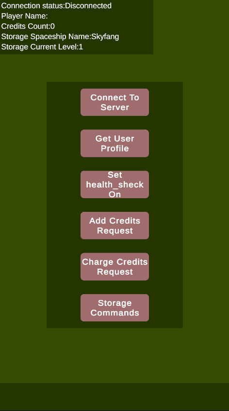
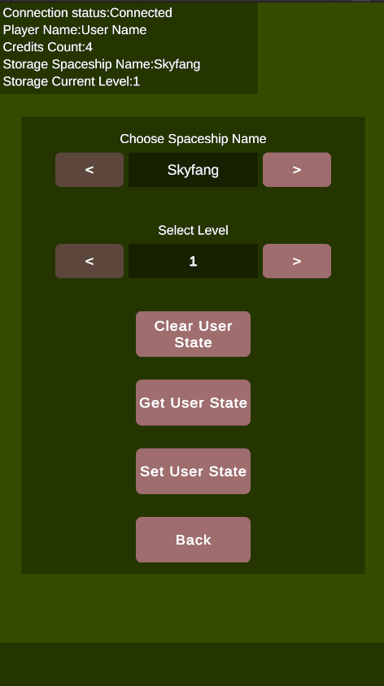
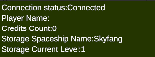
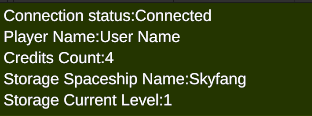
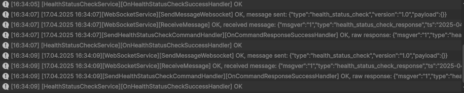
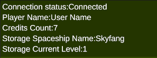
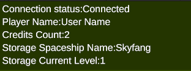

# Testing the Integration

## Example Scene

Open the example scene to test plugin functionality:
`Assets > Luxodd.Game > Example > Scenes > ExampleScene`

## Available Test Functions

Use the following buttons in the scene:

### Main Command Panel

- **Connect to Server** — initiates a server connection
- **Get User Profile** — requests the user's profile and credit balance
- **Toggle Health Check** — sends a health_status_check every 2 seconds
- **Add Credits Request** — adds 5 credits (requires PIN input)
- **Charge Credits Request** — deducts 3 credits (requires PIN input)
- **Storage Commands** — switches to the User State Test Panel, which allows testing of the server-side user state storage.

### User State Commands Panel

This panel is used strictly for testing how user state is stored and synchronized with the server. It does not affect gameplay logic.

- **Input Fields (Top Two Fields)** - Example of selecting a spaceship type and setting a level.

:::note
These are only test parameters for internal state, not actual gameplay values.
:::

- **Clear User State** - Sends a command to the server that clears all saved data (sends null as the user state).
- **Get User State** - Requests the current user state from the server and applies it locally on the client.
- **Set User State** - Sends the current client-side user state to the server.
- **Back** - Returns to the Main Command Panel.

:::note
Error handling for incorrect PIN codes is not implemented in this sample.
:::

## Next Steps

- [Start integrating the plugin](./integration.md)
- [Review API documentation](./api-reference.mdx)
