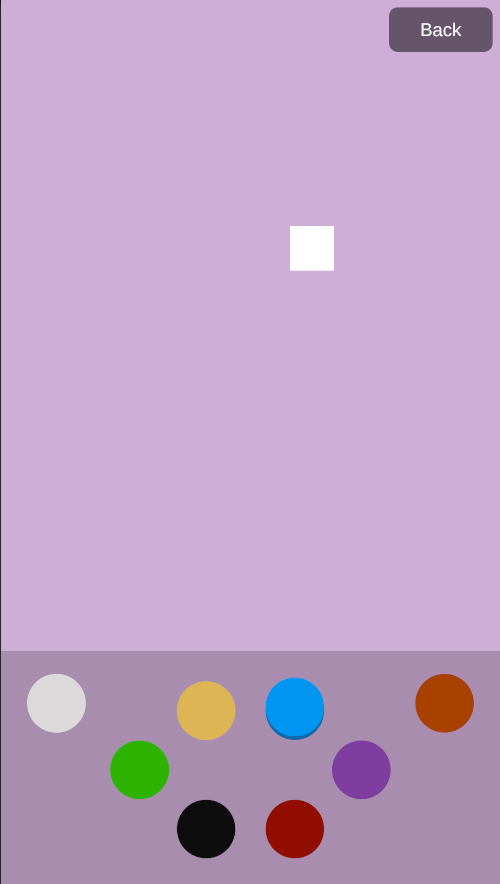

# Testing the Integration

## Example Scene

Open the example scene to test plugin functionality:
`Assets > Luxodd.Game > Example > Scenes > ExampleScene`

## Available Test Functions

Use the following buttons in the scene:

### Main Command Panel

- **Connect to Server** — initiates a server connection
- **Get User Profile** — requests the user's profile and credit balance
- **Toggle Health Check** — sends a health_status_check every 2 seconds
- **Add Credits Request** — adds 5 credits (requires PIN input)
- **Charge Credits Request** — deducts 3 credits (requires PIN input)
- **Storage Commands** — switches to the User State Test Panel, which allows testing of the server-side user state storage.
- **Controlling Test** — opens a local input testing scene

### User State Commands Panel

This panel is used strictly for testing how user state is stored and synchronized with the server. It does not affect gameplay logic.

- **Input Fields (Top Two Fields)** - Example of selecting a spaceship type and setting a level.

:::note
These are only test parameters for internal state, not actual gameplay values.
:::

- **Clear User State** - Sends a command to the server that clears all saved data (sends null as the user state).
- **Get User State** - Requests the current user state from the server and applies it locally on the client.
- **Set User State** - Sends the current client-side user state to the server.
- **Back** - Returns to the Main Command Panel.

:::note
Error handling for incorrect PIN codes is not implemented in this sample.
:::

A detailed description of the JSON request and response for each command, as well as additional explanations, can be found in the [WebSocket Postman Collection ](../websocket.mdx) section.

## Controlling Test

The **Controlling Test** button opens a separate test scene designed specifically to validate arcade joystick and button input.

This scene is **fully local** and does not interact with the server or user state.

### What this scene demonstrates

- A simple 2D square sprite that represents a placeholder player
- Movement of the square using the arcade joystick
- A visual representation of arcade buttons at the bottom of the screen
- Button highlighting:
  - When a physical arcade button is pressed, the corresponding on-screen button is highlighted
  - When the button is released, it returns to its default state

### What developers can test here

- Verify joystick direction and movement behavior
- See which physical buttons are available
- Understand how button presses are detected by Unity
- Confirm correct arcade-to-Unity input mapping visually

This scene is intended as a **quick debugging and learning tool** to help developers understand and verify control mappings before implementing gameplay logic.

:::note
This test scene does not bind any controls to gameplay actions.  
It only visualizes input events for debugging and reference purposes.
:::

## Advanced Controlling Test (Gameplay Example)

In addition to the basic input visualization scene, the plugin includes a **fully interactive gameplay test scene**.

This scene is designed to demonstrate **real-world usage** of arcade input in a typical 2D action game.

### What this scene demonstrates

- Character movement using the arcade joystick
- Stable facing direction and sprite flipping based on movement
- Ladder interaction:
  - Vertical movement when the player is inside a ladder zone
  - Gravity is disabled while climbing
- Jump action triggered by a button press
- Semi-automatic weapon firing:
  - Hold the fire button to shoot
  - Fixed fire rate (3 shots per second)
- Item interaction:
  - Pick up a key object
  - Use the key to open a door when nearby

### Purpose of this scene

This scene serves as:

- A **reference implementation** for gameplay input handling
- A **learning tool** for junior and junior+ developers
- A **validation tool** to ensure arcade controls behave correctly in real gameplay scenarios

Unlike the basic Controlling Test, this scene applies input to actual gameplay logic and physics.

:::note
This scene is fully local and does not interact with the server or user state.
It is intended for gameplay and input validation only.
:::

## Next Steps

- [Start integrating the plugin](./integration.md)
- [Review API documentation](./api-reference.mdx)
