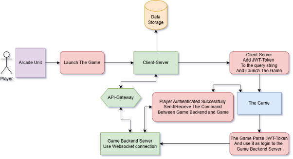

# How to Install

## Game Template Description

This section describes the classes and methods implemented in the prototype to facilitate game integration. The steps outlined assume the game is developed using the Unity engine, but other WebGL-compatible engines can also be used, provided that necessary system commands are implemented.

### Developing a WebGL Game in Unity

The platform for game development is WebGL. Before proceeding with the integration steps, **it is essential** to read Unity's WebGL documentation and ensure the game is prepared for this platform: [Unity WebGL Documentation](https://docs.unity3d.com/2022.3/Documentation/Manual/webgl.html)

### Technical Requirements

- **Unity Version:** 2019+ (tested on Unity 2022.3.52f1)

### Game Launch Process

The game is launched from the arcade unit via an `index.html` page inside an `iFrame`. Upon startup, a crucial parameter—**JWT Token**—is passed via the **query string**. This token is used for player authentication with the WebSocket server, establishing a connection for in-game interactions.
